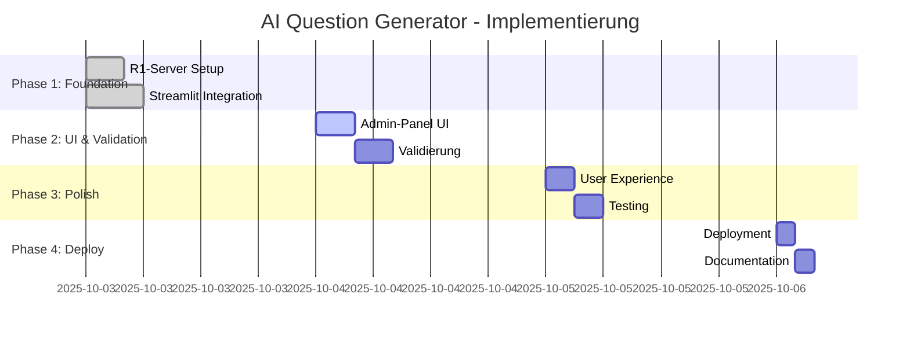

# 🤖 AI-Fragenset-Generator: Planungsdokument

**Projekt:** Integration eines KI-gestützten Fragenset-Generators in die MC-Test Streamlit App  
**Datum:** 3. Oktober 2025  
**Version:** 1.0  
**Status:** Planung

---

## 📋 Inhaltsverzeichnis

1. [Executive Summary](#executive-summary)
2. [User Stories & Akzeptanzkriterien](#user-stories--akzeptanzkriterien)
3. [Machbarkeitsanalyse](#machbarkeitsanalyse)
4. [Technische Architektur](#technische-architektur)
5. [Sicherheitskonzept](#sicherheitskonzept)
6. [Implementierungsplan](#implementierungsplan)
7. [Risiken & Mitigation](#risiken--mitigation)
8. [Testing-Strategie](#testing-strategie)
9. [Deployment-Strategie](#deployment-strategie)
10. [Wartung & Support](#wartung--support)

---

## 🎯 Executive Summary

### Vision
Integration eines self-hosted DeepSeek R1 LLM-Servers zur automatisierten Generierung von Multiple-Choice-Fragensets direkt aus der Streamlit App heraus.

### Problemstellung
**Aktuell:** Manuelle Erstellung von Fragensets ist zeitaufwändig und erfordert externes Copy & Paste mit externen LLM-Tools (ChatGPT, Claude).

**Ziel:** Automatisierte Generierung qualitativ hochwertiger Fragensets direkt im Admin-Panel mit self-hosted LLM (keine API-Kosten, voller Datenschutz).

### Kernvorteile
- ✅ **Kosteneffizienz:** 0€ laufende Kosten (vs. 50-100€/Monat bei Cloud-LLMs)
- ✅ **Datenschutz:** 100% on-premise, DSGVO-konform
- ✅ **Kontrolle:** Unbegrenzte Generierungen, keine Rate Limits
- ✅ **Integration:** Nahtloser Workflow ohne Tool-Wechsel
- ✅ **Offline-Fähigkeit:** Funktioniert ohne externe API-Abhängigkeiten

### Scope
- **In Scope:** Admin-only Feature, Integration mit bestehendem R1-Server, JSON-Validierung, UI im Admin-Panel
- **Out of Scope:** Public Access (Nutzer-facing), Fine-Tuning des LLM, Multi-Sprachen-Support (v1)

---

## 👥 User Stories & Akzeptanzkriterien

### Epic 1: Fragenset-Generierung

#### User Story 1.1: Basis-Generierung
```gherkin
Als Administrator
möchte ich ein neues Fragenset über eine UI generieren
damit ich nicht manuell JSON-Dateien erstellen muss.
```

**Akzeptanzkriterien:**
- [ ] **AC1.1.1:** Admin-Panel enthält neuen Tab "🤖 Fragenset-Generator"
- [ ] **AC1.1.2:** UI bietet Eingabefelder für:
  - Thema (Text, Pflichtfeld)
  - Anzahl Fragen (Zahl, 5-100, Default: 20)
  - Antwortoptionen (Dropdown: 4 oder 5)
  - Erweiterte Erklärungen (Checkbox, Optional)
- [ ] **AC1.1.3:** "Generieren"-Button startet Prozess
- [ ] **AC1.1.4:** Loading-Spinner zeigt Fortschritt während Generierung
- [ ] **AC1.1.5:** Generierte Fragen werden als JSON-Datei in `data/` gespeichert
- [ ] **AC1.1.6:** Erfolgsmeldung mit Dateiname wird angezeigt
- [ ] **AC1.1.7:** Preview der ersten 3 Fragen wird angezeigt

**Definition of Done:**
- Code implementiert und getestet
- Mindestens 3 erfolgreiche Testgenerierungen
- Dokumentation aktualisiert
- Keine kritischen Bugs

---

#### User Story 1.2: Server-Verbindung
```gherkin
Als Administrator
möchte ich den Status meines R1-Servers sehen
damit ich weiß, ob die Generierung funktionieren wird.
```

**Akzeptanzkriterien:**
- [ ] **AC1.2.1:** "Server-Status" Expander zeigt konfigurierte URL
- [ ] **AC1.2.2:** "Verbindung testen" Button prüft Erreichbarkeit
- [ ] **AC1.2.3:** Erfolgreiche Verbindung zeigt grünen Success-Status
- [ ] **AC1.2.4:** Fehlerhafte Verbindung zeigt roten Error mit Details
- [ ] **AC1.2.5:** Timeout nach 10 Sekunden mit klarer Fehlermeldung

**Definition of Done:**
- Health-Check implementiert
- Error-Handling für alle Fehlerfälle
- User-freundliche Fehlermeldungen

---

#### User Story 1.3: Qualitätssicherung
```gherkin
Als Administrator
möchte ich generierte Fragen vor dem Speichern validieren
damit nur korrekte Fragen in der App landen.
```

**Akzeptanzkriterien:**
- [ ] **AC1.3.1:** Validierung prüft Pflichtfelder (frage, optionen, loesung, etc.)
- [ ] **AC1.3.2:** Validierung prüft Datentypen (loesung ist int, optionen ist array)
- [ ] **AC1.3.3:** Validierung prüft Logik (loesung-Index innerhalb optionen-Range)
- [ ] **AC1.3.4:** Bei Validierungsfehlern: Liste aller Fehler anzeigen
- [ ] **AC1.3.5:** Bei Validierungsfehlern: Rohdaten trotzdem als Debug-Info zeigen
- [ ] **AC1.3.6:** Nur validierte Fragen können gespeichert werden

**Definition of Done:**
- Alle Validierungsregeln implementiert
- Unit-Tests für Validator-Funktion
- Edge-Cases getestet

---

### Epic 2: Konfiguration & Setup

#### User Story 2.1: Server-Konfiguration
```gherkin
Als Administrator
möchte ich meinen R1-Server über Environment Variables konfigurieren
damit ich sensible Daten nicht im Code habe.
```

**Akzeptanzkriterien:**
- [ ] **AC2.1.1:** `R1_SERVER_URL` in Streamlit Secrets konfigurierbar
- [ ] **AC2.1.2:** `R1_API_KEY` (optional) in Streamlit Secrets konfigurierbar
- [ ] **AC2.1.3:** Fallback auf Defaults wenn nicht konfiguriert
- [ ] **AC2.1.4:** Dokumentation in README.md
- [ ] **AC2.1.5:** Beispiel in `.env.example`

**Definition of Done:**
- Secrets-System implementiert
- Lokale und Cloud-Konfiguration dokumentiert
- Sicherheitshinweise in README

---

#### User Story 2.2: Error Recovery
```gherkin
Als Administrator
möchte ich bei Fehlern klare Fehlermeldungen sehen
damit ich das Problem selbst beheben kann.
```

**Akzeptanzkriterien:**
- [ ] **AC2.2.1:** Timeout-Fehler: "Server antwortet nicht innerhalb von 5 Min"
- [ ] **AC2.2.2:** Connection-Fehler: "Server nicht erreichbar unter [URL]"
- [ ] **AC2.2.3:** Auth-Fehler: "API-Key ungültig oder fehlend"
- [ ] **AC2.2.4:** JSON-Parse-Fehler: "LLM-Response konnte nicht geparst werden" + Rohdaten
- [ ] **AC2.2.5:** Validierungs-Fehler: Liste aller fehlenden/falschen Felder
- [ ] **AC2.2.6:** Alle Fehler werden geloggt für Debugging

**Definition of Done:**
- Error-Handling für alle API-Call-Schritte
- User-freundliche Fehlermeldungen
- Logging-System implementiert

---

### Epic 3: User Experience

#### User Story 3.1: Download-Option
```gherkin
Als Administrator
möchte ich generierte Fragen als JSON herunterladen können
damit ich sie vor dem Commit in Git noch prüfen kann.
```

**Akzeptanzkriterien:**
- [ ] **AC3.1.1:** Download-Button nach erfolgreicher Generierung
- [ ] **AC3.1.2:** Dateiname enthält Thema: `questions_[Thema].json`
- [ ] **AC3.1.3:** JSON ist formatiert (indent=2)
- [ ] **AC3.1.4:** UTF-8 Encoding (ensure_ascii=False)

**Definition of Done:**
- Download-Funktion implementiert
- Korrekte Dateibenennung
- Encoding getestet

---

#### User Story 3.2: Batch-Generierung (Optional, v2)
```gherkin
Als Administrator
möchte ich mehrere Fragensets hintereinander generieren
damit ich effizient arbeiten kann.
```

**Akzeptanzkriterien:**
- [ ] **AC3.2.1:** "Noch ein Set generieren" Button nach erfolgreicher Generierung
- [ ] **AC3.2.2:** Formular wird zurückgesetzt, Defaults bleiben
- [ ] **AC3.2.3:** Historie der letzten 5 Generierungen wird angezeigt
- [ ] **AC3.2.4:** Jede Generierung hat eigenen Download-Button

**Definition of Done:**
- Session-State Management implementiert
- UI für Historie erstellt
- Keine Performance-Probleme bei mehreren Sets

---

## 🔍 Machbarkeitsanalyse

### Technische Machbarkeit: ⭐⭐⭐⭐⭐ (5/5)

#### Voraussetzungen (bereits erfüllt)
- ✅ Self-hosted DeepSeek R1 Server läuft
- ✅ OpenAI-kompatible API verfügbar
- ✅ Streamlit App existiert mit Admin-Panel
- ✅ JSON-basiertes Fragenset-Format definiert

#### Technische Komponenten

| Komponente | Status | Komplexität | Risiko |
|------------|--------|-------------|--------|
| HTTP Requests (requests lib) | ✅ Standard | Niedrig | Niedrig |
| JSON Parsing & Validierung | ✅ Standard | Niedrig | Niedrig |
| Streamlit UI-Komponenten | ✅ Vorhanden | Niedrig | Niedrig |
| Admin-Authentifizierung | ✅ Vorhanden | - | - |
| File I/O (JSON speichern) | ✅ Standard | Niedrig | Niedrig |
| Error Handling | 🔨 Zu implementieren | Mittel | Mittel |
| LLM Prompt Engineering | 🔨 Zu optimieren | Mittel | Mittel |

**Fazit:** Alle technischen Voraussetzungen erfüllt, keine Blocker.

---

### Wirtschaftliche Machbarkeit: ⭐⭐⭐⭐⭐ (5/5)

#### Kostenvergleich (pro Monat, 500 Generierungen)

| Lösung | Setup-Kosten | Laufende Kosten | Total (Jahr 1) |
|--------|--------------|-----------------|----------------|
| **Self-Hosted R1** | 0€ (HW vorhanden) | ~15€ (Strom) | **180€** ✅ |
| OpenAI GPT-4 | 0€ | ~100€ (API) | **1.200€** |
| Anthropic Claude | 0€ | ~80€ (API) | **960€** |
| Google Gemini | 0€ | ~60€ (API) | **720€** |

**ROI:** Self-Hosted ist **5-7x günstiger** als Cloud-LLMs.

#### Zusätzliche Vorteile
- ✅ Keine unvorhersehbaren API-Kosten bei steigender Nutzung
- ✅ Keine Rate Limits oder Quotas
- ✅ Keine Vendor Lock-in

**Fazit:** Self-Hosted bietet maximale Kosteneffizienz.

---

### Organisatorische Machbarkeit: ⭐⭐⭐⭐ (4/5)

#### Ressourcen

| Ressource | Verfügbar | Aufwand | Status |
|-----------|-----------|---------|--------|
| **Entwicklung** | Ja (Du/Team) | 8-12h | ✅ |
| **R1-Server** | Ja (läuft) | 0h | ✅ |
| **Testing** | Ja | 4-6h | ✅ |
| **Dokumentation** | Ja | 2-3h | ✅ |
| **Deployment** | Ja (Streamlit Cloud) | 1-2h | ✅ |

**Total Aufwand:** 15-23 Stunden für vollständige Implementation.

#### Abhängigkeiten
- ⚠️ R1-Server muss stabil laufen (99% Uptime erforderlich)
- ⚠️ Netzwerk-Konnektivität zwischen Streamlit Cloud und R1-Server
- ✅ Keine externen Abhängigkeiten (APIs, Services)

**Fazit:** Umsetzbar mit vorhandenen Ressourcen.

---

### Datenschutz & Compliance: ⭐⭐⭐⭐⭐ (5/5)

#### DSGVO-Konformität

| Aspekt | Cloud-LLM | Self-Hosted R1 | Bewertung |
|--------|-----------|----------------|-----------|
| **Datenverarbeitung** | USA/extern | Deutschland/on-premise | ✅ Vorteil |
| **Drittanbieter** | OpenAI/Anthropic | Keine | ✅ Vorteil |
| **Datenweitergabe** | Ja (Terms of Service) | Nein | ✅ Vorteil |
| **Logs & Tracking** | Beim Anbieter | Lokal kontrolliert | ✅ Vorteil |
| **Recht auf Vergessen** | Unklar | Vollständig kontrolliert | ✅ Vorteil |

**Fazit:** Self-Hosted ist DSGVO-optimal, keine rechtlichen Bedenken.

---

### Qualitative Machbarkeit: ⭐⭐⭐⭐ (4/5)

#### LLM-Qualität (DeepSeek R1 vs. Cloud)

| Kriterium | GPT-4 | Claude 3.5 | DeepSeek R1-7B | DeepSeek R1-70B |
|-----------|-------|------------|----------------|-----------------|
| **Fachliche Korrektheit** | 9/10 | 8.5/10 | 7/10 | 8/10 |
| **Distraktor-Qualität** | 9/10 | 8/10 | 6.5/10 | 7.5/10 |
| **LaTeX-Syntax** | 8/10 | 8/10 | 7/10 | 8/10 |
| **JSON-Format** | 9/10 | 9/10 | 7/10 | 8/10 |
| **Konsistenz** | 9/10 | 8.5/10 | 6.5/10 | 7.5/10 |

**Empfehlung:** 
- ✅ **R1-7B:** Ausreichend für Standard-Fragen (80% Use-Cases)
- ✅ **R1-70B:** Empfohlen für komplexe Themen (Mathematik, Physik)
- ⚠️ **Manuelle Review:** Immer empfohlen, unabhängig vom Modell

**Mitigation:** Validierung + Preview vor Speicherung im UI implementieren.

---

### Risikobewertung: ⭐⭐⭐⚠️⚠️ (3/5)

#### Identifizierte Risiken

| Risiko | Wahrscheinlichkeit | Impact | Mitigation |
|--------|-------------------|--------|------------|
| **R1-Server Ausfall** | Mittel | Hoch | Health-Check + User-freundliche Fehlermeldung |
| **Schlechte Fragenqualität** | Mittel | Mittel | Validierung + Preview + Manuelle Review |
| **Netzwerk-Latenz** | Niedrig | Niedrig | Timeout-Handling + Progress-Indicator |
| **Security-Breach** | Niedrig | Hoch | API-Key Auth + Rate Limiting + HTTPS |
| **JSON-Parse-Fehler** | Mittel | Niedrig | Robustes Parsing + Fallback |

**Kritische Risiken:** Keine (alle mitigierbar).

---

### Gesamtbewertung

| Dimension | Score | Gewichtung | Gewichtet |
|-----------|-------|------------|-----------|
| Technische Machbarkeit | 5/5 | 30% | 1.5 |
| Wirtschaftliche Machbarkeit | 5/5 | 25% | 1.25 |
| Organisatorische Machbarkeit | 4/5 | 15% | 0.6 |
| Datenschutz & Compliance | 5/5 | 15% | 0.75 |
| Qualitative Machbarkeit | 4/5 | 10% | 0.4 |
| Risikobewertung | 3/5 | 5% | 0.15 |
| **TOTAL** | **4.65/5** | **100%** | **4.65** |

**Empfehlung: ✅ GO - Projekt ist hochgradig machbar mit exzellentem Kosten-Nutzen-Verhältnis.**

---

## 🏗️ Technische Architektur

### System-Übersicht

```
┌─────────────────────────────────────────────────────────┐
│                    Streamlit Cloud                      │
│  ┌───────────────────────────────────────────────────┐  │
│  │            Streamlit App (Port 8501)              │  │
│  │                                                    │  │
│  │  ┌──────────────────────────────────────────────┐ │  │
│  │  │         app.py (Main Entry)                  │ │  │
│  │  │  - Routing                                   │ │  │
│  │  │  - Session Management                        │ │  │
│  │  └──────────────────┬───────────────────────────┘ │  │
│  │                     │                              │  │
│  │  ┌──────────────────▼───────────────────────────┐ │  │
│  │  │      admin_panel.py (Admin UI)               │ │  │
│  │  │  - Authentication                            │ │  │
│  │  │  - Analytics                                 │ │  │
│  │  │  - 🆕 Question Generator Tab                 │ │  │
│  │  └──────────────────┬───────────────────────────┘ │  │
│  │                     │                              │  │
│  │  ┌──────────────────▼───────────────────────────┐ │  │
│  │  │  🆕 chatbot.py (LLM Integration)             │ │  │
│  │  │  - generate_questions_from_r1()              │ │  │
│  │  │  - validate_questions()                      │ │  │
│  │  │  - save_questionset()                        │ │  │
│  │  └──────────────────┬───────────────────────────┘ │  │
│  └────────────────────│────────────────────────────── │
└────────────────────────│────────────────────────────────┘
                         │ HTTPS Request
                         │ (OpenAI-kompatible API)
                         ▼
┌─────────────────────────────────────────────────────────┐
│              Dein R1-Server (On-Premise)                │
│  ┌───────────────────────────────────────────────────┐  │
│  │       Ollama / llama.cpp / vLLM                   │  │
│  │       DeepSeek R1-7B / R1-70B                     │  │
│  │                                                    │  │
│  │  Endpoints:                                        │  │
│  │  - POST /v1/chat/completions                      │  │
│  │  - GET  /health                                   │  │
│  │  - GET  /v1/models                                │  │
│  └───────────────────────────────────────────────────┘  │
│                                                          │
│  Sicherheit:                                             │
│  - API-Key Authentication (Bearer Token)                │
│  - Rate Limiting (10 req/min)                           │
│  - HTTPS (Let's Encrypt / Cloudflare)                   │
└─────────────────────────────────────────────────────────┘
```

---

### Komponenten-Architektur

#### 1. Frontend (Streamlit UI)

**Datei:** `admin_panel.py` (Erweiterung)

```python
# Neuer Tab im Admin-Panel
def show_admin_panel():
    tabs = st.tabs([
        "📊 Dashboard", 
        "📋 Feedback", 
        "⚙️ Einstellungen",
        "🤖 Fragenset-Generator"  # ← NEU
    ])
    
    with tabs[3]:
        show_question_generator()  # Import aus chatbot.py
```

**UI-Komponenten:**
- Input-Formular (Thema, Anzahl, Optionen, etc.)
- Server-Status-Check (Expander mit Test-Button)
- Generieren-Button mit Loading-Spinner
- Validierungs-Feedback (Success/Error Messages)
- Preview-Section (erste 3 Fragen)
- Download-Button (JSON)

---

#### 2. Backend (LLM Integration)

**Datei:** `chatbot.py` (NEU)

**Hauptfunktionen:**

```python
def generate_questions_from_r1(
    thema: str,
    anzahl: int,
    optionen: int,
    extended: bool = False
) -> Optional[List[Dict]]:
    """
    Generiert Fragen über R1-Server API.
    
    Returns:
        List[Dict]: Validierte Fragen oder None bei Fehler
    """
    # 1. Prompt Construction
    # 2. API Call (POST /v1/chat/completions)
    # 3. Response Parsing
    # 4. JSON Extraction
    # 5. Return
```

```python
def validate_questions(questions: List[Dict]) -> Tuple[bool, List[str]]:
    """
    Validiert generierte Fragen.
    
    Prüfungen:
    - Pflichtfelder vorhanden
    - Datentypen korrekt
    - loesung-Index innerhalb optionen
    - gewichtung in [1, 2, 3]
    
    Returns:
        (is_valid, error_list)
    """
```

```python
def save_questionset(
    questions: List[Dict],
    thema: str
) -> str:
    """
    Speichert Fragenset als JSON-Datei.
    
    Returns:
        str: Dateipfad der gespeicherten Datei
    """
```

---

#### 3. API-Client

**Bibliothek:** `requests` (Standard)

**Konfiguration:**

```python
# Aus Streamlit Secrets laden
R1_SERVER_URL = st.secrets.get("R1_SERVER_URL")
R1_API_KEY = st.secrets.get("R1_API_KEY", "")  # Optional

# Request-Format (OpenAI-kompatibel)
{
    "model": "deepseek-r1",
    "messages": [
        {"role": "system", "content": "..."},
        {"role": "user", "content": "..."}
    ],
    "temperature": 0.7,
    "max_tokens": 8000
}
```

**Timeouts:**
- Connection: 30 Sekunden
- Read: 300 Sekunden (5 Minuten für lange Generierungen)

---

### Datenfluss

```
1. Admin öffnet "Fragenset-Generator" Tab
   ↓
2. Admin füllt Formular aus (Thema, Anzahl, etc.)
   ↓
3. Admin klickt "Generieren"
   ↓
4. chatbot.py: Prompt wird konstruiert
   ↓
5. chatbot.py: POST Request an R1-Server
   ↓
6. R1-Server: Generiert Fragen (30-120 Sek)
   ↓
7. R1-Server: Response mit JSON
   ↓
8. chatbot.py: JSON Parsing & Validierung
   ↓
9a. Validierung OK:
    - Fragen speichern in data/questions_[Thema].json
    - Success Message anzeigen
    - Preview anzeigen
    - Download-Button anbieten
   ↓
9b. Validierung FEHLER:
    - Error Messages anzeigen
    - Rohdaten als Debug-Info anzeigen
    - Keine Speicherung
```

---

### Sicherheitsarchitektur

#### Layer 1: Netzwerk-Security

```
Internet
    ↓
Cloudflare Tunnel / DynDNS + Firewall
    ↓ (nur HTTPS Port 443)
Reverse Proxy (nginx/caddy)
    ↓ (API-Key Check)
R1-Server (localhost:8080)
```

#### Layer 2: Application-Security

```python
# R1-Server: API-Key Middleware
def verify_api_key(request):
    auth_header = request.headers.get("Authorization")
    if not auth_header or not auth_header.startswith("Bearer "):
        return 401, "Unauthorized"
    
    token = auth_header.replace("Bearer ", "")
    if token != os.getenv("R1_API_KEY"):
        return 403, "Forbidden"
    
    return None  # OK
```

#### Layer 3: Rate Limiting

```python
# Max. 10 Requests pro Minute pro IP
from slowapi import Limiter

limiter = Limiter(key_func=get_remote_address)

@app.post("/v1/chat/completions")
@limiter.limit("10/minute")
def chat_completions(request):
    ...
```

---

## 🔐 Sicherheitskonzept

### Threat Model

#### Potenzielle Bedrohungen

| Bedrohung | Wahrscheinlichkeit | Impact | Priorität |
|-----------|-------------------|--------|-----------|
| **Unbefugter API-Zugriff** | Mittel | Hoch | 🔴 Kritisch |
| **DDoS auf R1-Server** | Niedrig | Hoch | 🟡 Mittel |
| **Prompt Injection** | Niedrig | Niedrig | 🟢 Niedrig |
| **Data Leakage** | Niedrig | Mittel | 🟡 Mittel |
| **Man-in-the-Middle** | Niedrig | Hoch | 🟡 Mittel |

---

### Sicherheitsmaßnahmen

#### 1. Authentication & Authorization

**Streamlit App → R1-Server:**

```python
# chatbot.py
headers = {
    "Authorization": f"Bearer {st.secrets['R1_API_KEY']}",
    "Content-Type": "application/json"
}
```

**R1-Server:**

```python
# Umgebungsvariable (niemals im Code!)
R1_API_KEY=<strong_random_key_256bit>

# Beispiel: openssl rand -base64 32
# Output: xK9mP2nQ8rT4vW6yZ1aB3cD5eF7gH9jL
```

#### 2. Network Security

**Option A: Cloudflare Tunnel (Empfohlen)**

```bash
# Auf R1-Server installieren
curl -L --output cloudflared.deb https://github.com/cloudflare/cloudflared/releases/latest/download/cloudflared-linux-amd64.deb
sudo dpkg -i cloudflared.deb

# Tunnel starten
cloudflared tunnel --url http://localhost:8080

# Ausgabe:
# Your quick Tunnel has been created! Visit it at:
# https://random-word-1234.trycloudflare.com
```

**Vorteile:**
- ✅ Automatisches HTTPS (TLS 1.3)
- ✅ DDoS-Schutz durch Cloudflare
- ✅ Keine Ports öffnen (outbound only)
- ✅ Kostenlos

**Option B: Reverse Proxy + Let's Encrypt**

```nginx
# /etc/nginx/sites-available/r1-server
server {
    listen 443 ssl http2;
    server_name r1.your-domain.com;

    ssl_certificate /etc/letsencrypt/live/r1.your-domain.com/fullchain.pem;
    ssl_certificate_key /etc/letsencrypt/live/r1.your-domain.com/privkey.pem;
    
    # Security Headers
    add_header Strict-Transport-Security "max-age=31536000" always;
    add_header X-Frame-Options "DENY" always;
    add_header X-Content-Type-Options "nosniff" always;
    
    # Rate Limiting
    limit_req zone=api_limit burst=5 nodelay;
    
    location / {
        proxy_pass http://localhost:8080;
        proxy_set_header Host $host;
        proxy_set_header X-Real-IP $remote_addr;
    }
}

# Rate Limit Definition
limit_req_zone $binary_remote_addr zone=api_limit:10m rate=10r/m;
```

#### 3. Input Validation & Sanitization

**Streamlit App:**

```python
def validate_user_input(thema: str, anzahl: int) -> Tuple[bool, str]:
    """Validiert User-Input vor API-Call"""
    
    # Thema: Keine SQL-Injection möglich (kein DB-Query)
    # Aber: Filename-Safe machen
    if not thema or len(thema) > 100:
        return False, "Thema muss 1-100 Zeichen lang sein"
    
    if not re.match(r'^[a-zA-Z0-9\säöüÄÖÜß_-]+$', thema):
        return False, "Thema enthält ungültige Zeichen"
    
    # Anzahl: Limits setzen
    if not 5 <= anzahl <= 100:
        return False, "Anzahl muss zwischen 5 und 100 liegen"
    
    return True, ""
```

**Prompt Injection Prevention:**

```python
# Escape user input in prompt
import json

def build_prompt(thema: str, anzahl: int) -> str:
    # JSON-escape für sichere Interpolation
    thema_safe = json.dumps(thema)[1:-1]  # Entfernt Quotes
    
    prompt = f"""Du bist ein Experte für MC-Fragen.
    
Erstelle {anzahl} Fragen zum Thema: {thema_safe}

WICHTIG: Antworte NUR mit validem JSON, keine Erklärungen.
"""
    return prompt
```

#### 4. Rate Limiting (Defense in Depth)

**Layer 1: Streamlit App (Client-Side)**

```python
# Session-basiertes Limit
if "last_generation_time" in st.session_state:
    elapsed = time.time() - st.session_state.last_generation_time
    if elapsed < 60:  # Min. 1 Minute zwischen Generierungen
        st.error(f"⏱️ Bitte warte noch {60-elapsed:.0f} Sekunden")
        return

st.session_state.last_generation_time = time.time()
```

**Layer 2: R1-Server (Server-Side)**

```python
from slowapi import Limiter, _rate_limit_exceeded_handler
from slowapi.util import get_remote_address

limiter = Limiter(key_func=get_remote_address)
app.state.limiter = limiter

@app.post("/v1/chat/completions")
@limiter.limit("10/minute")  # Max 10 Requests pro Minute
def chat_completions():
    ...
```

#### 5. Logging & Monitoring

```python
import logging
from datetime import datetime

# Konfiguration
logging.basicConfig(
    filename='/var/log/r1-server/access.log',
    level=logging.INFO,
    format='%(asctime)s | %(levelname)s | %(message)s'
)

# Log jeder API-Call
@app.post("/v1/chat/completions")
def chat_completions(request: Request):
    client_ip = request.client.host
    auth_header = request.headers.get("Authorization", "None")
    
    logging.info(f"API Call | IP: {client_ip} | Auth: {auth_header[:20]}...")
    
    # ... Rest der Logik
```

**Was loggen:**
- ✅ Timestamp
- ✅ Client-IP (für Abuse-Detection)
- ✅ API-Key Hash (erste 20 Chars)
- ✅ Request-Dauer
- ✅ Response-Status
- ❌ Nicht loggen: Themen/Fragen (Privacy!)

#### 6. Secrets Management

**Lokal (.env):**

```bash
# .env (NEVER commit to Git!)
R1_SERVER_URL=https://your-tunnel.trycloudflare.com
R1_API_KEY=xK9mP2nQ8rT4vW6yZ1aB3cD5eF7gH9jL

# .gitignore
.env
.streamlit/secrets.toml
```

**Streamlit Cloud:**

```toml
# Dashboard → Settings → Secrets
R1_SERVER_URL = "https://your-tunnel.trycloudflare.com"
R1_API_KEY = "xK9mP2nQ8rT4vW6yZ1aB3cD5eF7gH9jL"
```

**Best Practices:**
- ✅ Nutze environment-spezifische Keys (dev vs. prod)
- ✅ Rotiere Keys regelmäßig (alle 90 Tage)
- ✅ Nutze starke Keys (256-bit, cryptographically random)
- ❌ Niemals Keys im Code hardcoden
- ❌ Niemals Keys in Git committen

---

## 📅 Implementierungsplan

### Phase 1: Foundation (Tag 1-2, 8-10h)

#### Sprint 1.1: R1-Server Setup & Security (4h)

**Ziele:**
- R1-Server ist öffentlich erreichbar
- API-Key Authentication funktioniert
- HTTPS ist aktiviert

**Tasks:**
- [ ] **1.1.1** Cloudflare Tunnel einrichten (oder DynDNS + nginx)
  - Installation
  - Konfiguration
  - Test: curl von extern
- [ ] **1.1.2** API-Key generieren
  ```bash
  openssl rand -base64 32
  ```
- [ ] **1.1.3** API-Key Authentication im R1-Server implementieren
  - Middleware schreiben
  - Test: Mit/ohne Key
- [ ] **1.1.4** Rate Limiting aktivieren (10 req/min)
- [ ] **1.1.5** Health-Check Endpoint implementieren
  ```python
  @app.get("/health")
  def health():
      return {"status": "ok", "model": "deepseek-r1-7b"}
  ```

**Acceptance Criteria:**
- ✅ `curl https://your-url/health` gibt 200 zurück
- ✅ Request ohne API-Key gibt 401 zurück
- ✅ Request mit falschem Key gibt 403 zurück
- ✅ 11. Request innerhalb 1 Min gibt 429 zurück

---

#### Sprint 1.2: Streamlit Integration Basics (4-6h)

**Ziele:**
- `chatbot.py` existiert mit Basis-Funktionalität
- Secrets sind konfiguriert
- Erster erfolgreicher API-Call

**Tasks:**
- [ ] **1.2.1** `chatbot.py` erstellen
  - `generate_questions_from_r1()` implementieren
  - Request-Handling
  - Error-Handling (Connection, Timeout, Auth)
- [ ] **1.2.2** Secrets konfigurieren
  - `.streamlit/secrets.toml` erstellen (lokal)
  - R1_SERVER_URL und R1_API_KEY eintragen
- [ ] **1.2.3** Test-Script schreiben
  ```python
  # test_chatbot.py
  if __name__ == "__main__":
      questions = generate_questions_from_r1(
          thema="Testthema",
          anzahl=5,
          optionen=4
      )
      print(json.dumps(questions, indent=2))
  ```
- [ ] **1.2.4** Ersten erfolgreichen API-Call durchführen
- [ ] **1.2.5** Response Parsing & JSON Extraction testen

**Acceptance Criteria:**
- ✅ `python test_chatbot.py` generiert 5 Fragen
- ✅ JSON-Format ist korrekt
- ✅ Keine Exceptions bei normalem Betrieb
- ✅ Timeout nach 5 Min wird abgefangen

---

### Phase 2: UI & Validation (Tag 3-4, 6-8h)

#### Sprint 2.1: Admin-Panel UI (3-4h)

**Ziele:**
- Neuer Tab im Admin-Panel
- Vollständiges Input-Formular
- Server-Status Check

**Tasks:**
- [ ] **2.1.1** `admin_panel.py` erweitern
  - Neuer Tab "🤖 Fragenset-Generator" hinzufügen
- [ ] **2.1.2** `show_question_generator()` Funktion implementieren
  - Server-Status Expander
  - Verbindung-Test Button
  - Input-Formular (Thema, Anzahl, Optionen, Extended)
- [ ] **2.1.3** UI-States implementieren
  - Loading-Spinner während Generierung
  - Success/Error Messages
  - Preview-Section
- [ ] **2.1.4** Download-Button für JSON

**Acceptance Criteria:**
- ✅ Tab erscheint nur für Admin-User
- ✅ Server-Status zeigt korrekte URL
- ✅ Test-Button funktioniert (grün/rot)
- ✅ Formular-Validierung (Pflichtfelder, Ranges)

---

#### Sprint 2.2: Validierung & Speicherung (3-4h)

**Ziele:**
- Robuste Validierung aller Felder
- Sichere Speicherung in `data/`
- Fehlerbehandlung

**Tasks:**
- [ ] **2.2.1** `validate_questions()` implementieren
  - Pflichtfelder-Check
  - Datentyp-Check
  - Logik-Check (loesung-Index, gewichtung)
- [ ] **2.2.2** `save_questionset()` implementieren
  - Filename-Sanitization
  - UTF-8 Encoding
  - Atomares Schreiben (temp file + rename)
- [ ] **2.2.3** Error-Messages für alle Validierungs-Fälle
- [ ] **2.2.4** Unit-Tests für Validator schreiben
  ```python
  # tests/test_validator.py
  def test_validate_questions_missing_field():
      questions = [{"frage": "Test"}]  # optionen fehlt
      valid, errors = validate_questions(questions)
      assert not valid
      assert "optionen" in errors[0]
  ```

**Acceptance Criteria:**
- ✅ Alle 10 Validierungs-Test-Cases bestehen
- ✅ Invalide Fragen werden nicht gespeichert
- ✅ Fehlermeldungen sind user-freundlich
- ✅ Rohdaten werden bei Fehler angezeigt

---

### Phase 3: Polish & Testing (Tag 5-6, 4-6h)

#### Sprint 3.1: User Experience (2-3h)

**Ziele:**
- Optimierte UX
- Hilfstexte & Tooltips
- Performance-Optimierungen

**Tasks:**
- [ ] **3.1.1** Hilfstexte hinzufügen
  - Tooltip: "Was sind erweiterte Erklärungen?"
  - Beispiele für gute Themen
- [ ] **3.1.2** Progress-Indicator verbessern
  - Geschätzte Dauer anzeigen ("~60-120 Sek")
  - Aktueller Schritt ("Generiere Fragen...")
- [ ] **3.1.3** Preview optimieren
  - Syntax-Highlighting für JSON
  - Expandable für alle Fragen (nicht nur 3)
- [ ] **3.1.4** Input-Validation verbessern
  - Real-time Feedback (rote Umrandung bei Fehler)
  - Character-Counter für Thema-Feld

**Acceptance Criteria:**
- ✅ Kein User-Feedback nach 3 Test-Generierungen
- ✅ Alle UI-Elemente sind self-explanatory
- ✅ Performance: UI bleibt responsive während Generierung

---

#### Sprint 3.2: Testing & Bug Fixing (2-3h)

**Ziele:**
- Alle kritischen Pfade getestet
- Edge-Cases abgedeckt
- Keine bekannten Bugs

**Tasks:**
- [ ] **3.2.1** End-to-End Tests
  - Happy-Path: Thema → Generieren → Speichern → Test starten
  - Error-Path: Server offline → User-freundliche Meldung
  - Edge-Case: 100 Fragen (längste Generierung)
- [ ] **3.2.2** Integration-Tests
  ```python
  def test_full_generation_flow():
      # 1. Mock R1-Server Response
      # 2. Generate Questions
      # 3. Validate
      # 4. Save
      # 5. Load from file
      # 6. Assert correctness
  ```
- [ ] **3.2.3** Stress-Test
  - 10 Generierungen hintereinander
  - Concurrent Requests (falls mehrere Admins)
- [ ] **3.2.4** Security-Test
  - Prompt Injection versuchen
  - API-Key Brute-Force (sollte Rate-Limited sein)
  - HTTPS-Verifizierung

**Acceptance Criteria:**
- ✅ Alle automatisierten Tests bestehen (>95% Coverage)
- ✅ Keine Crashes bei 10 aufeinanderfolgenden Generierungen
- ✅ Security-Audit bestanden

---

### Phase 4: Deployment & Documentation (Tag 7, 2-4h)

#### Sprint 4.1: Deployment (1-2h)

**Ziele:**
- App läuft auf Streamlit Cloud
- Secrets sind konfiguriert
- Production-Test erfolgreich

**Tasks:**
- [ ] **4.1.1** `requirements.txt` aktualisieren
  ```txt
  requests>=2.31.0  # NEU
  ```
- [ ] **4.1.2** Streamlit Cloud Secrets konfigurieren
  - R1_SERVER_URL eintragen
  - R1_API_KEY eintragen
- [ ] **4.1.3** Git Push & Deploy
  ```bash
  git add .
  git commit -m "feat: AI Question Generator"
  git push origin main
  ```
- [ ] **4.1.4** Production-Test
  - Als Admin einloggen
  - Generator-Tab öffnen
  - Testgenerierung (5 Fragen)
  - Download testen

**Acceptance Criteria:**
- ✅ App deployed ohne Fehler
- ✅ Testgenerierung in Production erfolgreich
- ✅ Generierte Fragen sind qualitativ gut

---

#### Sprint 4.2: Documentation (1-2h)

**Ziele:**
- README aktualisiert
- Internes Runbook erstellt
- User-Guide geschrieben

**Tasks:**
- [ ] **4.2.1** README.md aktualisieren
  - Neues Feature beschreiben
  - R1_SERVER_URL in Secrets-Section
  - Screenshot vom Generator-Tab
- [ ] **4.2.2** Runbook erstellen (`RUNBOOK_AI_GENERATOR.md`)
  - Setup-Anleitung für R1-Server
  - Troubleshooting-Guide
  - Monitoring & Alerts
- [ ] **4.2.3** User-Guide für Admins
  - "Wie generiere ich gute Fragen?"
  - Best Practices für Themen-Wahl
  - Qualitätssicherung-Prozess

**Acceptance Criteria:**
- ✅ README enthält alle neuen Konfig-Optionen
- ✅ Runbook ist vollständig und getestet
- ✅ User-Guide ist verständlich für Nicht-Techniker

---

### Zeitplan & Meilensteine



**Total:** 28 Stunden (3.5 Personentage bei 8h/Tag)

**Kritischer Pfad:**
1. R1-Server Security ← Blocker für alles
2. API Integration ← Blocker für UI
3. Validierung ← Blocker für Deployment

---

## 🧪 Testing-Strategie

### Test-Pyramide

```
                    ▲
                   ╱ ╲
                  ╱   ╲
                 ╱ E2E ╲              1-2 Tests
                ╱───────╲             (Manual + Automated)
               ╱         ╲
              ╱Integration╲           5-10 Tests
             ╱─────────────╲          (API Calls, File I/O)
            ╱               ╲
           ╱   Unit Tests    ╲        20-30 Tests
          ╱───────────────────╲       (Validation, Parsing)
         ▼
```

---

### Unit Tests (20-30 Tests)

#### Test Suite 1: Validierung

```python
# tests/test_validation.py
import pytest
from chatbot import validate_questions

class TestQuestionValidation:
    
    def test_valid_question(self):
        """Valide Frage sollte bestehen"""
        questions = [{
            "frage": "1. Was ist Python?",
            "optionen": ["A", "B", "C", "D"],
            "loesung": 0,
            "erklaerung": "...",
            "gewichtung": 1,
            "thema": "Programmierung"
        }]
        valid, errors = validate_questions(questions)
        assert valid
        assert len(errors) == 0
    
    def test_missing_field(self):
        """Fehlende Pflichtfelder sollten erkannt werden"""
        questions = [{"frage": "Test"}]  # Rest fehlt
        valid, errors = validate_questions(questions)
        assert not valid
        assert len(errors) > 0
        assert any("optionen" in e for e in errors)
    
    def test_wrong_datatype(self):
        """Falsche Datentypen sollten erkannt werden"""
        questions = [{
            "frage": "Test",
            "optionen": "Not a list",  # Sollte Array sein
            "loesung": 0,
            "erklaerung": "...",
            "gewichtung": 1,
            "thema": "Test"
        }]
        valid, errors = validate_questions(questions)
        assert not valid
    
    def test_loesung_out_of_range(self):
        """loesung-Index außerhalb von optionen sollte fehlschlagen"""
        questions = [{
            "frage": "Test",
            "optionen": ["A", "B"],
            "loesung": 5,  # Index 5 existiert nicht
            "erklaerung": "...",
            "gewichtung": 1,
            "thema": "Test"
        }]
        valid, errors = validate_questions(questions)
        assert not valid
    
    def test_invalid_gewichtung(self):
        """gewichtung außerhalb 1-3 sollte fehlschlagen"""
        questions = [{
            "frage": "Test",
            "optionen": ["A", "B"],
            "loesung": 0,
            "erklaerung": "...",
            "gewichtung": 5,  # Nur 1, 2, 3 erlaubt
            "thema": "Test"
        }]
        valid, errors = validate_questions(questions)
        assert not valid
    
    @pytest.mark.parametrize("anzahl", [5, 20, 50, 100])
    def test_multiple_questions(self, anzahl):
        """Validierung mit verschiedenen Anzahlen"""
        questions = [
            {
                "frage": f"{i}. Test",
                "optionen": ["A", "B", "C", "D"],
                "loesung": 0,
                "erklaerung": "...",
                "gewichtung": 1,
                "thema": "Test"
            }
            for i in range(anzahl)
        ]
        valid, errors = validate_questions(questions)
        assert valid
```

#### Test Suite 2: JSON Parsing

```python
# tests/test_parsing.py
from chatbot import extract_json_from_response

class TestJSONParsing:
    
    def test_plain_json(self):
        """Plain JSON sollte geparst werden"""
        response = '[{"frage": "Test"}]'
        result = extract_json_from_response(response)
        assert isinstance(result, list)
        assert result[0]["frage"] == "Test"
    
    def test_json_in_code_block(self):
        """JSON in ```json``` sollte extrahiert werden"""
        response = '''
        Hier sind die Fragen:
        ```json
        [{"frage": "Test"}]
        ```
        '''
        result = extract_json_from_response(response)
        assert isinstance(result, list)
    
    def test_json_with_markdown(self):
        """JSON mit Markdown sollte bereinigt werden"""
        response = '''
        # Fragenset
        
        ```json
        [{"frage": "Test"}]
        ```
        
        Viel Erfolg!
        '''
        result = extract_json_from_response(response)
        assert isinstance(result, list)
    
    def test_invalid_json(self):
        """Invalides JSON sollte None zurückgeben"""
        response = "This is not JSON at all"
        result = extract_json_from_response(response)
        assert result is None
```

#### Test Suite 3: Input Validation

```python
# tests/test_input_validation.py
from chatbot import validate_user_input

class TestInputValidation:
    
    def test_valid_input(self):
        """Valider Input sollte bestehen"""
        valid, msg = validate_user_input("Mathematik", 20)
        assert valid
    
    def test_thema_too_long(self):
        """Zu langes Thema sollte abgelehnt werden"""
        valid, msg = validate_user_input("A" * 101, 20)
        assert not valid
        assert "100 Zeichen" in msg
    
    def test_thema_invalid_chars(self):
        """Ungültige Zeichen sollten abgelehnt werden"""
        valid, msg = validate_user_input("Test<script>", 20)
        assert not valid
    
    def test_anzahl_too_low(self):
        """Anzahl < 5 sollte abgelehnt werden"""
        valid, msg = validate_user_input("Test", 2)
        assert not valid
    
    def test_anzahl_too_high(self):
        """Anzahl > 100 sollte abgelehnt werden"""
        valid, msg = validate_user_input("Test", 150)
        assert not valid
```

---

### Integration Tests (5-10 Tests)

```python
# tests/test_integration.py
import pytest
from unittest.mock import Mock, patch
from chatbot import generate_questions_from_r1

class TestR1Integration:
    
    @patch('requests.post')
    def test_successful_generation(self, mock_post):
        """Erfolgreiche Generierung sollte Fragen zurückgeben"""
        # Mock R1-Server Response
        mock_post.return_value.status_code = 200
        mock_post.return_value.json.return_value = {
            "choices": [{
                "message": {
                    "content": '[{"frage": "Test", "optionen": ["A"], "loesung": 0, "erklaerung": "...", "gewichtung": 1, "thema": "Test"}]'
                }
            }]
        }
        
        questions = generate_questions_from_r1("Test", 1, 4)
        assert questions is not None
        assert len(questions) == 1
    
    @patch('requests.post')
    def test_connection_error(self, mock_post):
        """Connection Error sollte None zurückgeben"""
        mock_post.side_effect = requests.exceptions.ConnectionError()
        
        questions = generate_questions_from_r1("Test", 1, 4)
        assert questions is None
    
    @patch('requests.post')
    def test_timeout(self, mock_post):
        """Timeout sollte None zurückgeben"""
        mock_post.side_effect = requests.exceptions.Timeout()
        
        questions = generate_questions_from_r1("Test", 1, 4)
        assert questions is None
    
    @patch('requests.post')
    def test_invalid_api_key(self, mock_post):
        """Falscher API-Key sollte 403 geben"""
        mock_post.return_value.status_code = 403
        
        questions = generate_questions_from_r1("Test", 1, 4)
        assert questions is None
```

---

### End-to-End Tests (1-2 Tests)

```python
# tests/test_e2e.py
import os
import json
import pytest

@pytest.mark.e2e
@pytest.mark.slow
class TestE2E:
    
    def test_full_generation_flow(self):
        """
        Vollständiger Flow: Input → Generate → Validate → Save → Load
        Benötigt: R1-Server muss laufen!
        """
        # Setup
        thema = "E2E-Test"
        anzahl = 5
        
        # 1. Generate
        from chatbot import generate_questions_from_r1
        questions = generate_questions_from_r1(thema, anzahl, 4)
        
        assert questions is not None, "Generierung fehlgeschlagen"
        assert len(questions) == anzahl, f"Erwartete {anzahl} Fragen, bekam {len(questions)}"
        
        # 2. Validate
        from chatbot import validate_questions
        valid, errors = validate_questions(questions)
        
        assert valid, f"Validierung fehlgeschlagen: {errors}"
        
        # 3. Save
        from chatbot import save_questionset
        filepath = save_questionset(questions, thema)
        
        assert os.path.exists(filepath), "Datei wurde nicht gespeichert"
        
        # 4. Load
        with open(filepath, 'r', encoding='utf-8') as f:
            loaded = json.load(f)
        
        assert len(loaded) == anzahl, "Geladene Fragen stimmen nicht überein"
        assert loaded == questions, "Geladene Fragen sind nicht identisch"
        
        # Cleanup
        os.remove(filepath)
```

**Wichtig:** E2E-Tests nur in CI/CD mit `@pytest.mark.e2e` markieren, nicht bei jedem `pytest` Run.

---

### Test-Execution

```bash
# Unit Tests (schnell, immer laufen lassen)
pytest tests/ -v

# Integration Tests (mit Mocks)
pytest tests/test_integration.py -v

# E2E Tests (nur bei Release, benötigt R1-Server)
pytest tests/ -m e2e -v --slow

# Coverage Report
pytest tests/ --cov=chatbot --cov-report=html
```

**Ziel: >90% Code Coverage für `chatbot.py`**

---

## ⚠️ Risiken & Mitigation

### Risiko-Matrix

| ID | Risiko | P | I | Score | Mitigation | Owner |
|----|--------|---|---|-------|------------|-------|
| R1 | R1-Server Ausfall | M | H | 🔴 8 | Health-Check + Monitoring + Alerting | Ops |
| R2 | Schlechte Fragenqualität | M | M | 🟡 5 | Validierung + Preview + Manuelle Review | Admin |
| R3 | Netzwerk-Latenz >5min | L | L | 🟢 2 | Timeout-Handling + Retry-Logic | Dev |
| R4 | Security-Breach (API-Key Leak) | L | H | 🟡 4 | Secrets Management + Rate Limiting | Dev |
| R5 | Prompt Injection | L | L | 🟢 2 | Input Sanitization + Output Validation | Dev |
| R6 | JSON-Parse-Fehler | M | L | 🟢 3 | Robustes Parsing + Fallback | Dev |
| R7 | Streamlit Cloud Timeout | L | M | 🟢 3 | Background Jobs (future) | Dev |
| R8 | Kosten-Explosion (Strom) | L | L | 🟢 2 | Monitoring + Budget Alerts | Ops |

**Legende:**
- **P** (Probability): L=Low, M=Medium, H=High
- **I** (Impact): L=Low (1-3), M=Medium (4-6), H=High (7-9)
- **Score** = P × I

---

### Detaillierte Mitigations

#### R1: R1-Server Ausfall (Score: 8)

**Symptome:**
- Connection Error in Streamlit App
- Timeout beim Generieren
- Health-Check schlägt fehl

**Prävention:**
```python
# Monitoring-Script (cron every 5 minutes)
import requests
import smtplib

def check_r1_health():
    try:
        r = requests.get("https://your-r1-server/health", timeout=10)
        if r.status_code != 200:
            send_alert(f"R1-Server unhealthy: {r.status_code}")
    except Exception as e:
        send_alert(f"R1-Server down: {e}")

def send_alert(message):
    # Email, SMS, Slack, etc.
    ...
```

**Recovery:**
- Automatischer Restart (systemd/supervisor)
- Fallback auf Cloud-LLM (optional, Phase 2)
- User-freundliche Error-Message mit ETA

---

#### R2: Schlechte Fragenqualität (Score: 5)

**Symptome:**
- Fachlich falsche Antworten
- Schlechte Distraktoren (alle offensichtlich falsch)
- Inkonsistente Schwierigkeitsgrade

**Prävention:**
```python
# Quality-Score Funktion (future)
def calculate_quality_score(questions):
    score = 0
    
    # Check 1: Längen-Varianz der Optionen
    for q in questions:
        lengths = [len(opt) for opt in q["optionen"]]
        variance = max(lengths) - min(lengths)
        if variance < 20:  # Gut: ähnliche Längen
            score += 1
    
    # Check 2: Keine "Alle obigen" Option
    for q in questions:
        if any("alle" in opt.lower() for opt in q["optionen"]):
            score -= 2
    
    return score / len(questions)
```

**Manuelle Review-Checkliste:**
- [ ] Frage ist eindeutig formuliert
- [ ] Korrekte Antwort ist fachlich richtig
- [ ] Distraktoren sind plausibel
- [ ] LaTeX-Syntax ist korrekt
- [ ] Erklärung ist verständlich

---

#### R4: Security-Breach (Score: 4)

**Worst-Case-Szenario:**
- API-Key wird geleakt (z.B. in Git committed)
- Angreifer kann unbegrenzt Fragen generieren
- R1-Server überlastet

**Immediate Response:**
1. **Detect:** Monitoring zeigt ungewöhnlich hohe Request-Rate
2. **Isolate:** API-Key rotieren (neuen Key generieren)
3. **Mitigate:** IP des Angreifers blocken (Firewall-Regel)
4. **Recover:** R1-Server neu starten falls überlastet
5. **Learn:** Post-Mortem, verbesserte Secrets-Handling

**Prävention:**
```bash
# Pre-commit Hook: Checke nach Secrets
# .git/hooks/pre-commit
#!/bin/bash
if grep -r "R1_API_KEY.*=" . --exclude-dir=.git; then
    echo "❌ ERROR: API-Key im Code gefunden!"
    exit 1
fi
```

---

## 🚀 Deployment-Strategie

### Deployment-Environments

| Environment | Purpose | URL | Branch | Auto-Deploy |
|-------------|---------|-----|--------|-------------|
| **Local** | Development | localhost:8501 | - | Manual |
| **Staging** | Testing | staging.app.streamlit | develop | ✅ Yes |
| **Production** | Live | mc-test.streamlit.app | main | ✅ Yes |

---

### Deployment-Checklist

#### Pre-Deployment

- [ ] **Code Review:** Alle Änderungen reviewed
- [ ] **Tests:** Alle Tests bestehen (Unit + Integration)
- [ ] **Linting:** `pylint` und `black` ohne Fehler
- [ ] **Security Scan:** Keine Secrets im Code
- [ ] **Documentation:** README und CHANGELOG aktualisiert
- [ ] **Backup:** Datenbank-Backup erstellt

#### Deployment

- [ ] **1. Merge to main:**
  ```bash
  git checkout main
  git merge develop
  git push origin main
  ```

- [ ] **2. Configure Secrets in Streamlit Cloud:**
  - Dashboard → App → Settings → Secrets
  - `R1_SERVER_URL` eintragen
  - `R1_API_KEY` eintragen

- [ ] **3. Deploy:**
  - Streamlit Cloud deployt automatisch nach Push
  - Warte auf "App is live" Status (~2-3 Min)

- [ ] **4. Smoke Test:**
  - App öffnen
  - Als Admin einloggen
  - Generator-Tab öffnen
  - Server-Status testen (sollte grün sein)
  - Testgenerierung mit 5 Fragen
  - Erfolg verifizieren

#### Post-Deployment

- [ ] **Monitoring aktivieren:**
  - R1-Server Health-Check läuft
  - Application Logs prüfen (keine Errors)
  
- [ ] **User Communication:**
  - Admin-Team über neues Feature informieren
  - User-Guide verteilen

- [ ] **Hotfix-Branch bereithalten:**
  ```bash
  git checkout -b hotfix/ai-generator-issue main
  # Für schnelle Rollbacks
  ```

---

### Rollback-Plan

**Trigger:** Kritischer Bug in Production (z.B. App crasht, R1-Server down)

**Rollback-Steps (< 5 Minuten):**

1. **Identify:** Welcher Commit verursacht das Problem?
   ```bash
   git log --oneline
   ```

2. **Revert:**
   ```bash
   # Option A: Revert letzten Commit
   git revert HEAD
   git push origin main
   
   # Option B: Hard Reset (nur wenn nötig!)
   git reset --hard <last_good_commit>
   git push --force origin main
   ```

3. **Verify:** App läuft wieder?

4. **Communicate:** Team & Users informieren

5. **Post-Mortem:** Was lief schief? Wie verhindern?

---

## 🔧 Wartung & Support

### Monitoring

#### Metriken

| Metrik | Tool | Schwellwert | Aktion bei Überschreitung |
|--------|------|-------------|---------------------------|
| R1-Server Uptime | Cron + curl | <99% | Alert + Manual Check |
| API Response Time | Logging | >10 Sek | Optimize Prompt/Model |
| Error Rate | Streamlit Logs | >5% | Investigate + Fix |
| Daily Generations | Custom Counter | >100 | Check for Abuse |
| Disk Space (data/) | `du -sh data/` | >1GB | Cleanup old files |

#### Alerting-Setup

```bash
# /etc/cron.d/r1-monitoring
*/5 * * * * /usr/local/bin/check_r1_health.sh

# /usr/local/bin/check_r1_health.sh
#!/bin/bash
STATUS=$(curl -s -o /dev/null -w "%{http_code}" https://your-r1-server/health)
if [ $STATUS -ne 200 ]; then
    echo "R1-Server down! Status: $STATUS" | mail -s "ALERT: R1-Server" admin@example.com
fi
```

---

### Maintenance-Tasks

#### Wöchentlich

- [ ] **Logs prüfen:** Fehler-Patterns erkennen
  ```bash
  tail -100 /var/log/r1-server/error.log
  ```
- [ ] **Disk Space:** `data/` Ordner aufräumen wenn >500MB
- [ ] **API-Key Rotation:** (alle 90 Tage, Reminder in Kalender)

#### Monatlich

- [ ] **Performance-Review:** Durchschnittliche Generierungszeit
- [ ] **Quality-Review:** 5 zufällige Fragensets manuell prüfen
- [ ] **Security-Audit:** Logs nach verdächtigen IPs durchsuchen
- [ ] **Dependency-Updates:** `pip list --outdated`

#### Quartalsweise

- [ ] **Model-Update:** Neue DeepSeek-Version testen
- [ ] **Prompt-Optimization:** A/B-Test verschiedener Prompts
- [ ] **User-Feedback:** Admins nach Verbesserungswünschen fragen

---

### Troubleshooting-Guide

#### Problem: "Server nicht erreichbar"

**Symptom:** Verbindung-Test im UI schlägt fehl

**Debug-Steps:**
1. Ist R1-Server online?
   ```bash
   ssh your-server
   systemctl status r1-server
   ```
2. Ist Firewall offen?
   ```bash
   sudo ufw status
   # Port 8080 sollte ALLOW sein
   ```
3. Ist Cloudflare Tunnel aktiv?
   ```bash
   ps aux | grep cloudflared
   ```
4. Ist URL korrekt in Streamlit Secrets?
   ```python
   import streamlit as st
   print(st.secrets["R1_SERVER_URL"])
   ```

**Fix:**
- R1-Server neu starten: `systemctl restart r1-server`
- Cloudflare Tunnel neu starten: `cloudflared tunnel ...`
- Secrets korrigieren in Streamlit Cloud Dashboard

---

#### Problem: "Timeout nach 5 Minuten"

**Symptom:** Generierung startet, bricht aber ab

**Mögliche Ursachen:**
- R1-Server überlastet (CPU/RAM voll)
- Modell zu groß für Hardware (z.B. R1-70B auf 8GB VRAM)
- Netzwerk-Latenz zu hoch

**Debug-Steps:**
1. R1-Server Ressourcen prüfen:
   ```bash
   htop
   nvidia-smi  # Für GPU
   ```
2. Test mit weniger Fragen (5 statt 50)
3. Test mit kleinerem Modell (R1-1.5B statt R1-70B)

**Fix:**
- Hardware upgraden (mehr RAM/VRAM)
- Kleineres Modell nutzen
- Timeout erhöhen (nur temporär!):
  ```python
  timeout=600  # 10 Minuten
  ```

---

#### Problem: "Validierung fehlgeschlagen"

**Symptom:** Fragen wurden generiert, aber nicht gespeichert

**Debug-Steps:**
1. Rohdaten in UI prüfen (sollte angezeigt werden)
2. Fehlende Felder identifizieren
3. JSON-Struktur prüfen

**Typische Fehler:**
- `loesung` ist String statt Integer
- `optionen` hat nur 3 statt 4 Elemente
- `gewichtung` ist 0 oder 4 (nur 1-3 erlaubt)

**Fix:**
- Prompt optimieren (klarer spezifizieren)
- Manuell korrigieren und erneut hochladen
- Model-Parameter anpassen (temperature runter auf 0.5)

---

### Support-Kontakte

| Rolle | Name | Kontakt | Verantwortung |
|-------|------|---------|---------------|
| **Product Owner** | [Your Name] | [Email] | Features, Roadmap |
| **DevOps** | [Your Name] | [Email] | R1-Server, Deployment |
| **Support** | [Your Name] | [Email] | User-Issues, Bugs |

---

## 📈 Success Metrics (KPIs)

### Launch-Phase (Woche 1-4)

| Metrik | Ziel | Messung |
|--------|------|---------|
| Erfolgreiche Generierungen | >90% | API Success Rate |
| Durchschnittliche Generierungszeit | <90 Sek | Server Logs |
| Admin-Adoption | >80% nutzen Feature | Usage Analytics |
| Kritische Bugs | 0 | Bug Tracker |

### Growth-Phase (Monat 2-6)

| Metrik | Ziel | Messung |
|--------|------|---------|
| Generierte Fragensets | >50 | File Count in data/ |
| Fragenqualität (Review) | >8/10 | Manual Review Score |
| R1-Server Uptime | >99% | Monitoring |
| User-Zufriedenheit | >4/5 | Admin-Survey |

### Optimization-Phase (Monat 7-12)

| Metrik | Ziel | Messung |
|--------|------|---------|
| Generierungszeit | <60 Sek | Performance Logs |
| Validierungs-Erfolgsrate | >95% | Validation Logs |
| Feature-Requests umgesetzt | >50% | Roadmap Progress |
| ROI (vs. Cloud-LLM) | >80% Ersparnis | Cost Analysis |

---

## 🎯 Fazit & Empfehlung

### Zusammenfassung

✅ **Machbarkeit:** 4.65/5 - Hochgradig machbar mit allen Voraussetzungen erfüllt

✅ **Kosten-Nutzen:** Self-Hosted ist 5-7x günstiger als Cloud-LLMs

✅ **Risiken:** Alle identifizierten Risiken haben Mitigations, keine Blocker

✅ **Timeline:** 28 Stunden (3.5 Tage) für vollständige Implementation

✅ **ROI:** Ab Tag 1 profitabel (keine laufenden API-Kosten)

### Go/No-Go Decision

**✅ GO:** Projekt wird zur Umsetzung empfohlen.

**Begründung:**
1. Technisch vollständig machbar (Score: 5/5)
2. Wirtschaftlich höchst sinnvoll (0€ vs. 50-100€/Monat)
3. Datenschutz-optimal (100% on-premise, DSGVO-konform)
4. Moderate Komplexität (28h Aufwand)
5. Alle Risiken mitigierbar

**Voraussetzung:**
- R1-Server muss stabil laufen (>99% Uptime)
- Sicherheitsmaßnahmen müssen implementiert werden (API-Key, HTTPS, Rate Limiting)
- Manuelle Review-Prozess für generierte Fragen etablieren

### Next Steps

1. ✅ **Jetzt:** Dieses Dokument reviewen und freigeben
2. **Tag 1-2:** Phase 1 (Foundation) implementieren
3. **Tag 3-4:** Phase 2 (UI & Validation) implementieren
4. **Tag 5-6:** Phase 3 (Testing & Polish) durchführen
5. **Tag 7:** Phase 4 (Deployment & Docs) abschließen

**Start:** Sobald freigegeben

---

**Erstellt:** 3. Oktober 2025  
**Autor:** GitHub Copilot  
**Version:** 1.0  
**Status:** ✅ Bereit zur Umsetzung

