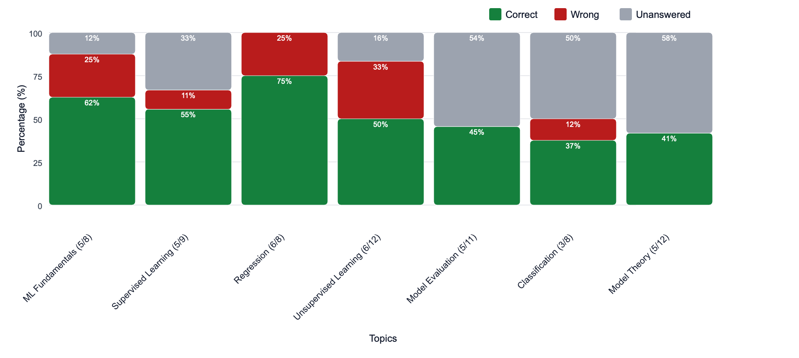
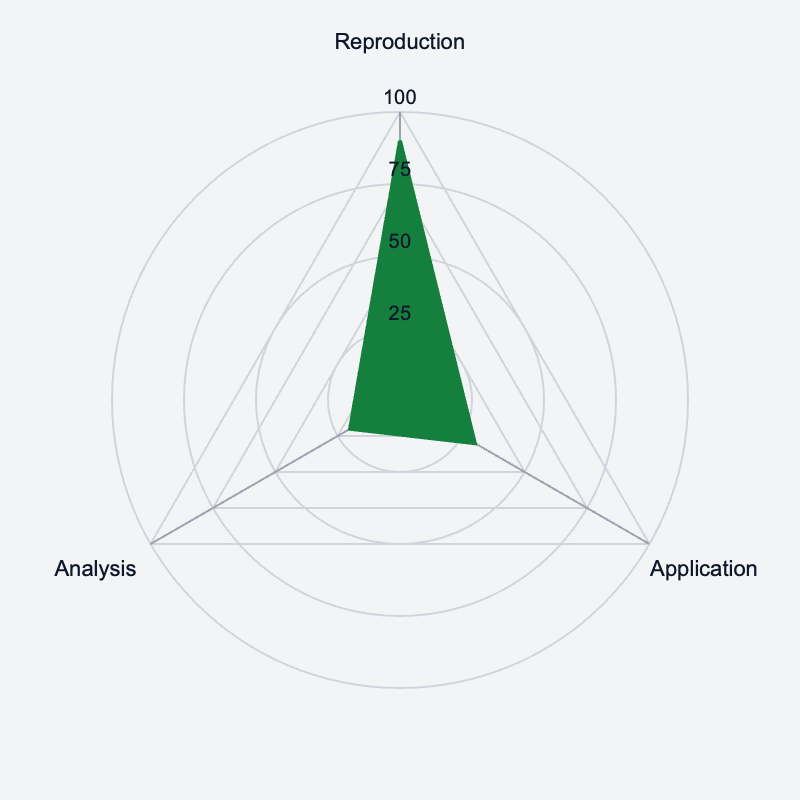
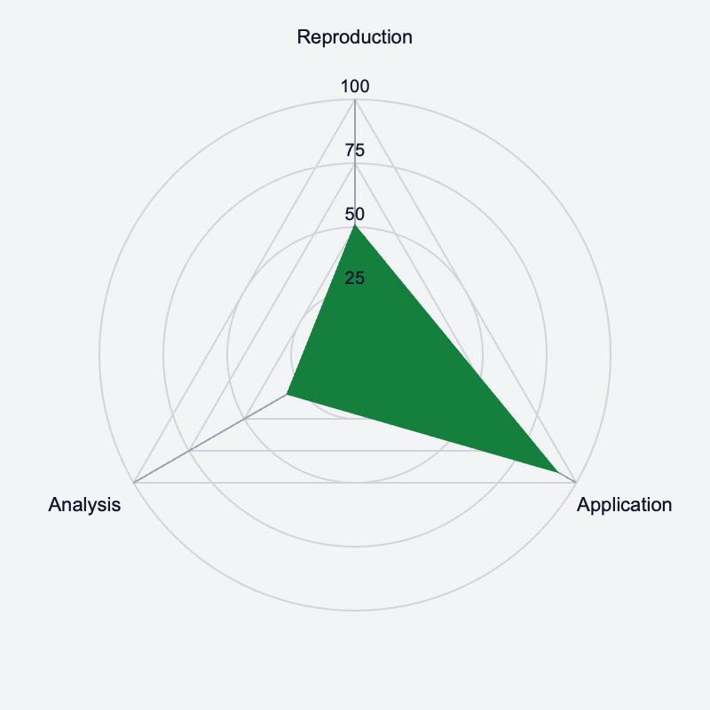
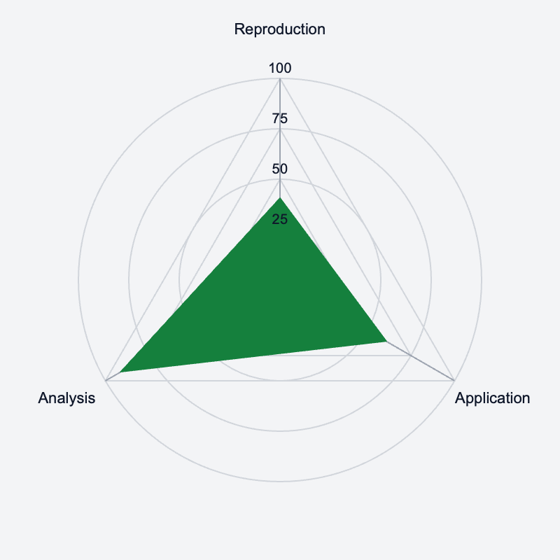
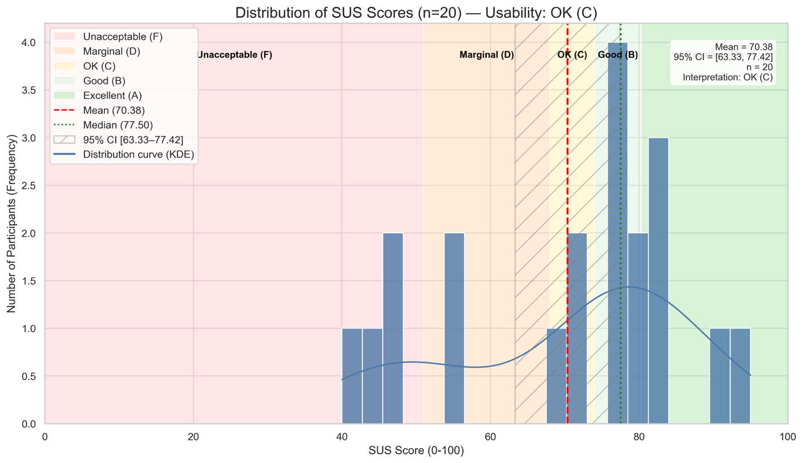
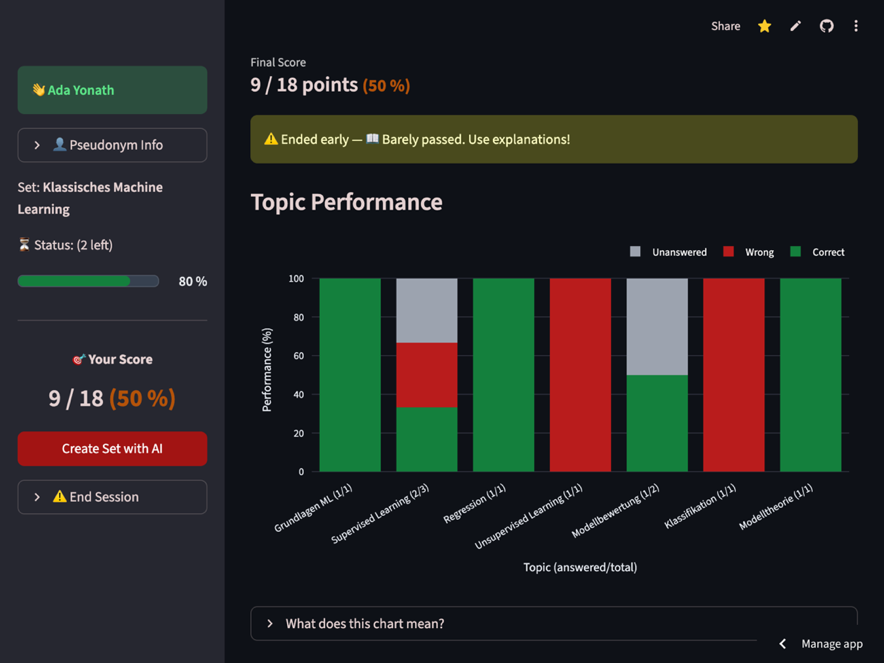

R. Bimberg, P. Kubica, K. Quibeldey-Cirkel

Technische Hochschule Mittelhessen (GERMANY)\
IU International University (GERMANY)

**Abstract:** Multiple-choice (MC) exams are widely used in higher
education but often provide little more than a summative score. This
substantially limits their value for metacognitive reflection and
self-regulated learning: students can see whether an answer is correct,
yet they rarely understand which cognitive demands they reliably master
and where targeted remediation should begin.

The paper presents *MC-Test*, an artificial intelligence (AI)-supported
platform that strengthens MC testing by integrating item generation,
feedback, and learner-facing analytics into a coherent architecture. A
didactic data model structures each item with a learning objective,
topic, weighting, and cognitive level, and deliberately constrains
AI-generated questions to three operationalized levels (reproduction,
application, and analysis). This constraint increases verifiability and
reduces the risk of semantic errors without shifting to higher-order
tasks (evaluation, creation) that are difficult to validate in an MC
format.

To support formative use, items include a brief explanation, detailed
rationales for all answer options, and a mini glossary for just-in-time
term clarification; for more complex tasks, *MC-Test* adds step-by-step
explanations. In a subsequent step, the system derives learning
objectives per cognitive level from items and labels and provides them
as a study resource (including glossary export). Based on these
metadata, the platform produces learner-facing summaries: a topic view
highlights domain-specific gaps and contextualizes metrics by showing
how many items have been attempted, while a cognitive radar profile
visualizes performance across the three levels and is displayed only
when enough data are available to avoid overinterpretation.

As a second core contribution, *MC-Test* incorporates a layer of
pedagogical control designed to reduce impulsive responding (e.g., rapid
guessing). Dynamic lockout periods before submission support careful
reading, and reflection windows after submission increase the likelihood
that formative feedback is used. An adaptive "panic mode" disables
pacing when the ratio of remaining time to remaining questions becomes
critical, prioritizing fairness under time pressure. All pacing
parameters are configurable at the course level and can be reduced or
disabled to support accessibility accommodations.

Technically, the item pipeline uses a finite-state interaction model
within the prompt architecture: configuration, internal planning, and
strict JavaScript Object Notation (JSON) schema-conformant output
improve consistency and parsability and facilitate downstream
psychometric checks. For data protection and sovereignty, *MC-Test* runs
in a containerized on-premise deployment and uses a local large language
model (LLM) backend, so prompts and student data remain within
institutional infrastructure; pseudonyms support anonymous
participation. An initial usability study using the System Usability
Scale (SUS) with a pilot cohort (N=20) yields a mean score of 70.38
("OK"-Range per Bangor et al.), indicating good user acceptance. Next
steps include randomized comparisons between conditions (or staged
rollout) and analyses of pacing-related behavior (rapid-guessing
indicators), response times, label reliability, and item statistics. The
application is open source and available under the MIT License on
GitHub.

**Keywords:** Artificial Intelligence in Education, Multiple-Choice
Question Generation, Student-Facing Learning Analytics, Adaptive Pacing,
Privacy-Preserving Local Language Models, Formative Assessment.

# 1. Introduction

Multiple-choice (MC) questions are widely used in university assessment
because they scale well, support objective scoring, and are easy to
administer in large cohorts. However, typical MC platforms provide
little more than a total score and item-level correctness, offering
limited support for metacognitive reflection and strategic exam
preparation. Learners often receive feedback that is too coarse to
inform their study strategies: they know *that* they failed, but not
*why*.

Recent advances in large language models (LLMs) enable not only the
automated generation of MC items but also richer internal
representations of their cognitive demands. When item metadata such as
topic, difficulty, and cognitive level are made explicit, MC tests can
be reinterpreted as data sources for learner-facing analytics.
Simultaneously, LLM-based coding assistants can substantially accelerate
programming tasks and lower the barrier for domain experts to prototype
tailored educational tools \[1\]. At the same time, studies have started
to assess the psychometric characteristics of LLM-generated MCQs,
including difficulty and discrimination indices. While such items can
exhibit competitive measurement properties in some settings, the
findings also underline the necessity of systematic item-level
validation rather than assuming quality from generation alone \[13\].

This paper positions *MC-Test* as a concrete instantiation of these
trends. It is a web-based platform integrating:

-   A didactic data model with explicit cognitive-level labels.

-   An LLM-based pipeline using a finite state interaction model for
    generating valid items.

-   Learner-facing analytics visualizing performance by cognitive level.

-   Pedagogical control mechanisms (dynamic cooldowns and pacing) to
    mitigate rapid guessing.

The platform was initially implemented using commercial LLM APIs and was
later migrated to a local LLM backend via Ollama. The work is guided by
the following research questions:

-   **RQ1:** How can cognitive-level classifications be operationalized
    in a student-facing assessment platform?

-   **RQ2:** How can LLMs be embedded via robust prompt engineering to
    support psychometric quality checks and reliable item generation?

-   **RQ3:** Which design considerations arise when migrating to a local
    LLM backend?

# 2. Theoretical Background and Related Work

**Cognitive Taxonomies and AI Validity:** Bloom's taxonomy has long
provided a framework for differentiating cognitive complexity. While
LLMs excel at generating content for lower taxonomic levels (remember,
understand), recent studies indicate significant reliability issues when
models attempt to generate tasks for higher-order evaluation or creation
without human-in-the-loop verification \[2\]. Consequently, automated MC
generation requires strict constraints to ensure semantic validity
\[3\].

**Student-Facing Learning Analytics & Self-Regulation:** Student-facing
learning analytics dashboards (SFLAD) aim to provide learners with
interpretable visualizations to support self-regulated learning \[4\].
However, research suggests that pure data visualization is often
insufficient; effective systems must provide active guidance or "nudges"
to translate insights into behavioral change \[5\]. In addition, prior
work provides design and evaluation recommendations for student-facing
learning analytics dashboards \[6\]. *MC-Test* addresses this by
combining analytics with active pacing mechanisms.

**Privacy in Generative AI:** The use of commercial LLM APIs in
education raises significant privacy concerns regarding data leakage and
GDPR compliance \[7\]. Recent work highlights the "privacy paradox" of
LLMs, suggesting that on-premise deployment (local LLMs) is a strong
mitigation option for sensitive educational contexts \[8\].

# 3. System Design: The *MC-Test* Platform

## 3.1 Pedagogical Requirements

*MC-Test* was designed for formative assessment in STEM courses. Key
requirements included:

-   **Cognitive transparency:** Items must be classified by cognitive
    level.

-   **Actionable feedback:** Explanations must link to learning
    objectives.

-   **Exam readiness:** Support for time management skills.

-   **Didactic control:** Educators must retain control over item
    quality.

## 3.2 System Architecture 

The application is implemented using the Python framework Streamlit and
has been migrated from a cloud-based prototype to a robust,
containerized microservice architecture. The entire stack is
orchestrated via Docker Compose and deployed on an on-premise
institutional server to ensure full data sovereignty. Key components
include:

-   **Data Persistence:** A PostgreSQL database replaces lightweight
    file-based storage to handle concurrent user sessions and complex
    relational data (user profiles, audit logs) reliably.

-   **Privacy-Compliant Rendering:** To eliminate data leakage to
    external Content Delivery Networks (CDNs), mathematical formulas are
    rendered using a self-hosted local **MathJax** instance.

-   **Local Inference Engine:** A central architectural shift is the
    integration of Ollama as a local LLM backend. This allows the
    platform to execute open-weights models (e.g., DeepSeek) entirely
    within the university\'s infrastructure, ensuring that neither
    student data nor prompt logic leaves the secure environment.

## 3.3 Didactic Data Model

The core is a strict JSON data model, with a schema excerpt shown in
Fig. 1. Key fields include:

-   **title**: The general topic of the entire question set (e.g., "Physics").
-   **topic**: A sub-topic that can span multiple questions of different cognitive levels (e.g., "Mechanics"; up to 10 per set).
-   **concept**: The central concept of the question, often addressing a common misconception (e.g., "Newton's laws").
-   **cognitive_level**: Operationalized as reproduction (weight 1), application (weight 2), or analysis (weight 3).
-   **mini_glossary**: 1-4 key terms with short definitions for just-in-time clarification.
-   **rationales**: Encompasses 'explanation' (brief) and 'extended_explanation' (step-by-step) for why each option is correct or incorrect.

## 3.4 Cognitive-Level Taxonomy for AI-Generated MCQs

*MC-Test* adopts a restricted three-level taxonomy inspired by Bloom: 1.
Reproduction (Weight 1): Recall of facts, definitions, or simple
algorithms. 2. Application (Weight 2): Use of known concepts in slightly
varied contexts. 3. Analysis (Weight 3): Interpretation of data,
comparison, or inference. Crucially, levels 4--6 (Evaluation, Creation)
are explicitly excluded. Our analysis aligns with findings that current
models lack the semantic grounding to reliably validate complex
evaluation tasks in a closed MC format \[2\] and with work emphasizing
that automated MC generation requires strict constraints to ensure
semantic validity \[3\]. Restricting the system to levels 1--3 increases
the verifiability of generated items and rationales and can reduce the
risk of semantic hallucinations; however, human review and empirical
item analysis remain necessary to ensure factual and psychometric
quality.

**3.4.1 Operationalization and Label Reliability**

Learner-facing analytics are predicated on cognitive-level labels;
consequently, *MC-Test* operationalizes the three levels with a brief
rubric and a verification step. In the present workflow, the following
three steps are taken. First, instructors define the learning objective
and the intended cognitive level. Second, the LLM is instructed to
generate an item that matches the specified level and to provide
rationales aligned with the learning objective. Third, items are
reviewed prior to release. To assess the reliability of the labeling
process, a double-coding procedure will be implemented. This procedure
will be executed by two instructors who will utilize a predetermined
rubric. The interrater agreement, as measured by metrics such as percent
agreement and Cohen\'s kappa, will be reported as part of the
evaluation. This approach serves to prevent over-precise interpretations
of learner-facing visualizations that lack the foundation of stable
labeling.

## 3.5 Prompt Architecture

Item generation is controlled by a context-engineered system instruction
set that operates as an "Interactive MCQ Generator." Instead of the
traditional zero-shot prompting approach, a finite-state interaction
model with a gated workflow is implemented: (1) Configuration Phase,
where the model elicits all required parameters sequentially (e.g.,
topic, target audience, item count and weight distribution, option
format, and optional curricular context) and requests explicit
confirmation before generation; (2) Internal Blueprinting, where the
model performs a hidden planning and consistency-check step (e.g.,
validating that difficulty weights map correctly to the difficulty
profile and that option/answer constraints are satisfiable) without
exposing intermediate reasoning in the output; and (3) Schema-Driven
Output, where the response is constrained to a single, strictly
parseable JSON object with explicit escaping and formatting rules
(including stable question_ids and a schema_version for forward
compatibility), Fig. 1. To improve robustness across heterogeneous
backends (cloud and local LLMs), the generated JSON is additionally
subjected to automated schema and semantic validation, with an optional
repair loop that prompts the model to apply minimal edits when
violations are detected.

Fig. 1: JSON schema for question sets to be generated via AI web
interface

{

\"meta\": {

\"schema_version\": \"1.1\",

\"title\": \"string (from Configuration Step 1)\",

\"created\": \"DD.MM.YYYY HH:MM\",

\"target_audience\": \"string (from Configuration Step 2)\",

\"question_count\": number,

\"difficulty_profile\": {

\"easy\": number,

\"medium\": number,

\"hard\": number

},

\"time_per_weight_minutes\": {

\"1\": 0.5,

\"2\": 0.75,

\"3\": 1.0

},

\"additional_buffer_minutes\": 5,

\"test_duration_minutes\": number

},

\"questions\": \[

{

\"question_id\": \"Q001\",

\"question\": \"string (Must start with \'1. \', \'2. \' etc.)\",

\"options\": \[\"string\", \"string\", \"string\"\],

\"answer\": number,

\"explanation\": \"string (2--4 sentences)\",

\"weight\": number,

\"topic\": \"string\",

\"concept\": \"string\",

\"cognitive_level\": \"string (Reproduction \| Application \|
Analysis)\",

\"extended_explanation\": null OR {\"title\": \"string\", \"steps\":
\[\"string\"\], \"content\": \"string\"},

\"mini_glossary\": \[

{\"term\": \"TermKey\", \"definition\": \"Definition string\"}

\]

}

\]

}

**Post-production learning objectives:** For each generated question
set, the LLM also proposes a small set of topic labels (typically \~10)
that structure the item bank. In a second, dedicated post-production
prompt, *MC-Test* derives learning objectives per cognitive level from
each item, its assigned topic, and its cognitive label. The resulting
objectives---phrased with Bloom-aligned action verbs---are compiled into
a learner-facing study resource that summarizes the intended learning
targets across topics and levels.

# 4. Learner-Facing Analytics and Pedagogical Control

## 4.1 Visualizing Topic Performance

To facilitate targeted remediation, the "Topic Performance" chart
provides a macro-level visualization of learner competence across
different subject domains, Fig. 2. Horizontal bars quantify the
percentage of maximum points achieved per topic, allowing for the
immediate identification of specific knowledge gaps. Crucially, the
system contextualizes these absolute values by displaying the ratio of
completed items to the total pool size in brackets (e.g., "3/5"). This
annotation serves as a transparency mechanism: it signals to the learner
that performance metrics derived from topics with a low volume of
questions (small N) reduce reliability and should be interpreted as a
heuristic indicator rather than a conclusive assessment.

{width="6.299212598425197in"
height="3.0879286964129484in"}

Fig. 2: Overview of learner competence across machine learning topics.
Horizontal bars represent the percentage of maximum achievable points
per subject domain, with absolute answer counts (correct/total)\
labeled below each bar.

## 

## 4.2 Visualizing Cognitive Profiles

At the test level, MC-Test aggregates results into views by topic and
cognitive level. A distinctive feature is the Cognitive Radar Chart,
which visualizes the learner's profile across the three axes
(Reproduction, Application, Analysis), Fig. 3. This exposes patterns
such as "binge learning" (high reproduction, low analysis), nudging
learners toward deeper understanding \[9\]. To facilitate metacognitive
diagnosis, the Cognitive Radar Chart quantifies learner performance by
calculating the ratio of achieved to potential points across the three
taxonomic levels. This visualization allows for the identification of
distinct cognitive archetypes based on the morphological characteristics
of the resulting plot. To reduce over-interpretation, MC-Test treats the
radar profile as a heuristic indicator rather than a diagnostic
measurement. The chart is only displayed when a minimum number of items
per axis is available; otherwise, the interface flags "insufficient
data" and recommends additional practice before interpreting the
profile. For example, a 'Theorist' or 'Crammer' profile---characterized
by a singular spike in Reproduction with steep drop-offs in higher-order
levels---indicates superficial rote learning with limited transfer
capabilities, prompting the system to recommend application-oriented
tasks. Conversely, a 'Practitioner' profile (high Application, low
Reproduction) suggests procedural fluency masked by theoretical
deficits, triggering recommendations to revisit foundational concepts.
Other patterns include the 'Analyst' (strong problem-solving with
foundational gaps) and the 'Zigzag' (inconsistent performance), enabling
the platform to derive specific, actionable interventions for each
learner type, provided sufficient item volume ensures statistical
reliability.

{width="2.047244094488189in"
height="2.047244094488189in"}
{width="2.047244094488189in"
height="2.047244094488189in"}
{width="2.047244094488189in"
height="2.047244094488189in"}

Fig. 3: Cognitive radar charts summarizing learner performance across
the three cognitive levels\
(reproduction, application, and analysis) for three learner archetypes:
Crammer (left), Practitioner (centre), and Theorist (right) (shown only
when sufficient items per axis are available).

## 4.2 Feedback and Explanations

For complex items, explanations are extended with step-by-step
reasoning. To support vocabulary acquisition, a two-tiered glossary
concept is used: a mini-glossary field for immediate help and a
summative PDF glossary for post-test review.

## 4.3 Pedagogical Control: Cooldowns and Panic Mode

A unique feature of *MC-Test* is its active management of learner
behavior to encourage reading and reflection and to deter impulsive
responding (e.g., rapid guessing). Rather than claiming to "enforce"
deep processing, the platform implements configurable pacing nudges
whose behavioral effects are treated as empirical questions to be
evaluated. The system implements a Pedagogical Control layer consisting
of three mechanisms: Pre-Answer Cooldown (reading support): to increase
the likelihood that students read the question before responding, the
"Submit" button remains disabled for a dynamic duration upon loading a
new item. This duration is calculated based on the item's weight
(complexity) and text length. Post-Answer Cooldown (Reflection Support):
After submitting an answer, navigation to the next question is delayed.
This creates a mandatory window for reviewing the formative feedback
\[10\]. The duration scales with the complexity of the explanation
(e.g., +10s for standard, +20s for extended explanations). Adaptive
Fairness ("Panic Mode"): While pacing can support metacognitive
reflection, it can be detrimental under time pressure. The system
continuously monitors the ratio of remaining time to remaining
questions. If this drops below a critical threshold (e.g., \<15 seconds
per question), the system activates "Panic Mode". In this state, all
cooldowns are overridden to allow the student to finish the attempt,
prioritizing fairness over didactic constraint in critical moments.
Accessibility and accommodations: Because fixed pacing can disadvantage
some learners (e.g., assistive-technology users or students with
documented accommodations), all cooldown parameters are configurable at
the course level and can be disabled or adjusted where required. Panic
Mode further acts as a fairness safeguard under time pressure,
prioritizing completion over pacing constraints.

# 5. Implementation and Migration to Local LLM Backend

The platform was migrated from commercial cloud APIs to an institutional
server with a local LLM backend (Ollama) to address data protection and
sustainability.

-   **Prompt Refactoring:** The system prompt was adapted to local model
    characteristics, prioritizing JSON validity and robustness.

-   **Privacy:** Local deployment ensures that no student data leaves
    the institution, adhering to "Privacy by Design" principles \[7\],
    \[8\].

-   **Sustainability:** On-premise hosting mitigates the costs and rate
    limits associated with commercial API usage.

-   **Data minimization and logging:** The deployment is designed to
    minimize sensitive data exposure. Only the information required for
    assessment and analytics is stored (e.g., answers, timestamps,
    aggregate scores), plus minimal account metadata and security audit
    logs needed to operate the system reliably. Prompts are constructed
    to avoid personal identifiers, and the local setup ensures that
    student data and prompt logic do not leave the secure environment.
    Access to logs and databases is restricted to authorized staff, and
    retention policies can be applied to limit long-term storage.

-   **Anonymity and pseudonyms:** *MC-Test* is designed for anonymous
    participation. Users do not create personal accounts, and no real
    names are collected. At the start of a session, learners select a
    pseudonym from a predefined list of Nobel and Turing Award laureate
    names; this identifier is used only to keep session data consistent
    (e.g., to display progress and aggregate analytics) without enabling
    real-world identification of participants, Fig. 5.

-   **Open-source availability:** To support transparency and
    reproducibility, the *MC-Test* Streamlit application is released
    under the MIT License and publicly available on GitHub
    (https://github.com/kqc-real/streamlit) The repository includes
    documentation for deployment and configuration (e.g., Docker
    Compose) as well as the schema-driven artifacts used in the local
    inference pipeline.

# 6. Evaluation Design and Outlook

**6.1 Planned Study Design**

The evaluation consists of pilot deployments in STEM modules.
Instruments include system log data (pacing choices, cognitive profiles,
response times), pre- and post-questionnaires on metacognitive awareness
and perceived usefulness, and interviews. A key next step is a
comparative study design (e.g., A/B testing or within-course phased
rollout) to test whether the Pedagogical Control features measurably
reduce rapid-guessing indicators and whether they affect learning
outcomes or study strategies. The planned evaluation also includes
checks of the stability of cognitive-level labeling (double-coding) and
basic item-level statistics to support psychometric interpretation of
generated question sets.

Initial informal trials indicate appreciation for the cognitive-level
breakdown and the transparency of AI-generated rationales. Reactions to
the pacing helper were mixed, highlighting the need for the adaptive
"Panic Mode" which was subsequently implemented. These observations are
exploratory and will be complemented by controlled comparisons using
behavioral log metrics and learner-reported measures.

**6.2 Preliminary Results: System Usability**

To validate the user experience (UX) and technical acceptance of the
platform, a standardized usability evaluation was conducted using the
System Usability Scale (SUS) \[11\]. The survey was administered to a
pilot cohort of 20 participants. The analysis yielded a mean SUS score
of 70.38. According to the adjective rating scale defined by Bangor et
al. \[12\], this score places the *MC-Test* platform in the "OK"
category, indicating good user acceptance despite the complexity of the
integrated pedagogical features. Fig. 4 illustrates the distribution of
individual participant scores. As shown in the diagram, the responses
are plotted against the interpretive acceptability ranges (e.g.,
"Acceptable," "Good," "Excellent"). The visualization reveals a
left-skewed distribution, confirming that the majority of users
perceived the system as easy to use. Importantly, SUS primarily captures
perceived usability; it does not establish learning benefits or
behavioral effects. These aspects will be examined in subsequent studies
using log-based rapid-guessing indicators, learner feedback on
fairness/autonomy, and (where feasible) learning outcome measures.

{width="6.317143482064742in"
height="3.6473775153105863in"}

Fig. 4: Distribution of System Usability Scale (SUS) scores (N=20);
background bands reflect the adjective rating scale \[12\], the
distribution is left-skewed (skewness = -0.625), indicating that higher
usability scores are more common with some lower outliers.

## 6.3 Limitations 

This paper primarily contributes a system design and preliminary
usability evidence. The proposed benefits of cognitive profiling and
pacing support (e.g., reduced rapid guessing, improved metacognitive
regulation) require empirical validation beyond SUS. Cognitive-level
labels can be interpretive; therefore, reliability checks
(double-coding) and psychometric item analyses are necessary to avoid
overconfident interpretations of learner-facing analytics. Finally,
pacing mechanisms may affect learner autonomy and accessibility;
configuration and accommodation pathways are required to avoid
unintended disadvantages.

Recent studies explicitly assess the psychometric properties of
LLM-generated questions, reinforcing the need to report item-level
statistics when using AI-generated MCQs in practice \[13\]. Beyond
classical item analysis, future work may also leverage "generative
student" simulations---LLM-based profiles that approximate response
patterns across different knowledge states---to flag ambiguous or
low-discrimination items before deployment \[14\].

## 7. Conclusion

*MC-Test* demonstrates that effective AI-supported assessment requires
more than simply calling an API. By combining engineered system
instructions (Finite-State Interaction Model and schema-constrained
generation) with didactic data models and pedagogical pacing support
(Cooldowns/Panic Mode), the platform aims to transform the MCQ format
from a summative drill into a formative, metacognitive tool. The
restriction to verifiable cognitive levels (Bloom 1--3) and the
migration to local LLMs strengthen the platform's verifiability and
data-sovereignty posture while supporting robust, parseable outputs.

{width="6.298285214348207in"
height="4.724409448818897in"}The primary contributions of this work are:
(1) a didactic item data model linking learning objectives, cognitive
levels, and formative rationales; (2) an operational concept of
Pedagogical Control (configurable cooldowns plus Panic Mode) intended to
nudge reading and reflection under realistic time constraints; and (3)
an architecture for local, schema-constrained LLM inference in an
assessment context. Initial usability results are encouraging; however,
evidence for learning impact, behavioral effects (e.g., rapid-guessing
reduction), label reliability, and psychometric item quality will be
addressed in planned comparative and log-based evaluations.

Fig. 5: MC-Test's interface showing end-of-session feedback and the
Topic Performance dashboard.

REFERENCES

1.  T. Weber, M. Brandmaier, A. Schmidt, and S. Mayer, "Significant
    Productivity Gains through Programming with Large Language Models,"
    Proc. ACM Hum.-Comput. Interact., vol. 8, EICS, Art. 256, 2024,
    doi:10.1145/3661145.

2.  N. Scaria, S. D. Chenna, and D. Subramani, "Automated Educational
    Question Generation at Different Bloom's Skill Levels Using Large
    Language Models: Strategies and Evaluation," in *Artificial
    Intelligence in Education (AIED 2024)*, LNAI vol. 14830, pp.
    165--179, 2024, doi: 10.1007/978-3-031-64299-9_12.

3.  P. Stalder, et al., "Ensuring Quality in AI-Generated
    Multiple-Choice Questions for Higher Education with the QUEST
    Framework," in Communications in Computer and Information Science,
    Springer, 2024.

4.  R. Bodily and K. Verbert, "Trends and issues in student-facing
    learning analytics reporting systems research," in *Proc. 7th Int.
    Conf. Learning Analytics & Knowledge (LAK '17)*, Vancouver, BC,
    Canada, Mar. 2017, pp. 309--318, doi: 10.1145/3027385.3027403.

5.  L. de Vreugd, et al., "Learning Analytics Dashboard Design and
    Evaluation to Support Student Self-Regulation of Study Behavior,"
    Journal of Learning Analytics, vol. 11, no. 3, 2024.

6.  I. Jivet, M. Scheffel, M. Specht, and H. Drachsler, "License to
    evaluate: Preparing learning analytics dashboards for educational
    practice," in *Proc. 8th Int. Conf. Learning Analytics & Knowledge
    (LAK '18)*, Sydney, NSW, Australia, Mar. 2018, pp. 31--40, doi:
    10.1145/3170358.3170421.

7.  H. Drachsler and W. Greller, "Privacy and Analytics: It's a DELICATE
    Issue---A Checklist for Trusted Learning Analytics," in Proceedings
    of the Sixth International Conference on Learning Analytics &
    Knowledge, Edinburgh, UK, 2016, pp. 89--98.

8.  Y. Shanmugarasa, M. Ding, M. A. P. Chamikara, and T. Rakotoarivelo,
    "SoK: The Privacy Paradox of Large Language Models: Advancements,
    Privacy Risks, and Mitigation," arXiv preprint arXiv:2506.12699,
    2025.

9.  Z. Yan and D. Carless, "Self-Assessment Is About More Than Self: The
    Enabling Role of Feedback Literacy," Assessment & Evaluation in
    Higher Education, vol. 47, no. 7, pp. 1116--1128, 2022.

10. N. E. Winstone and D. Carless, Designing Effective Feedback
    Processes in Higher Education: A Learning-Focused Approach. London:
    Routledge, 2019.

11. J. Brooke, "SUS: A 'Quick and Dirty' Usability Scale," in *Usability
    Evaluation in Industry*, P. W. Jordan, B. Thomas, B. A.
    Weerdmeester, and I. L. McClelland, Eds. London, U.K.: Taylor &
    Francis, 1996, pp. 189--194.

12. A. Bangor, P. T. Kortum, and J. T. Miller, "Determining what
    individual SUS scores mean: Adding an adjective rating scale,"
    Journal of Usability Studies, vol. 4, no. 3, pp. 114--123, 2009.

13. S. Bhandari, Y. Liu, Y. Kwak, and Z. A. Pardos, "Evaluating the
    psychometric properties of ChatGPT-generated questions," *Computers
    and Education: Artificial Intelligence*, vol. 7, Art. 100284, 2024,
    doi: 10.1016/j.caeai.2024.100284.

14. X. Lu and X. Wang, "Generative Students: Using LLM-Simulated Student
    Profiles to Support Question Item Evaluation," in *Proc. 11th ACM
    Conf. on Learning @ Scale (L@S '24)*, 2024, pp. 16--27, doi:
    10.1145/3657604.3662031.

15. 
