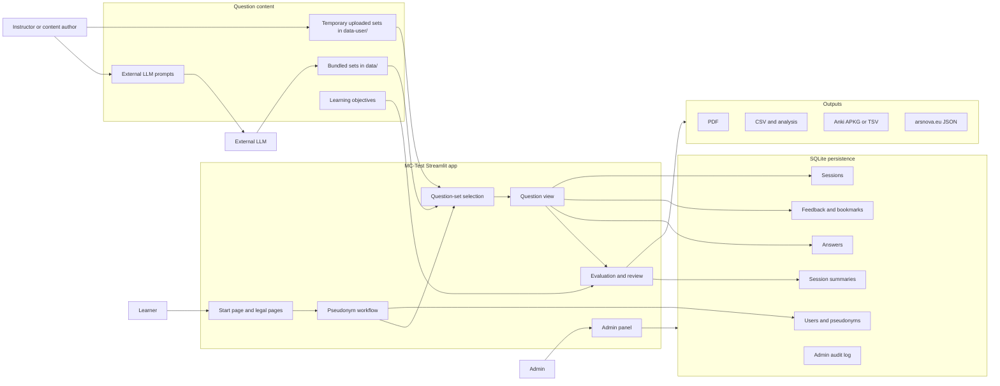
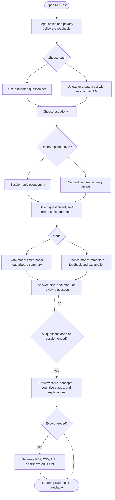
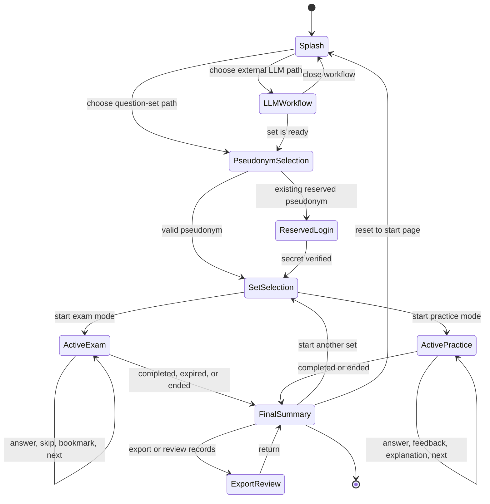
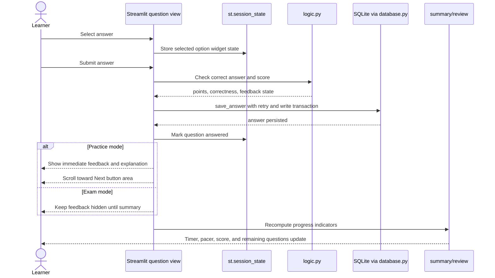
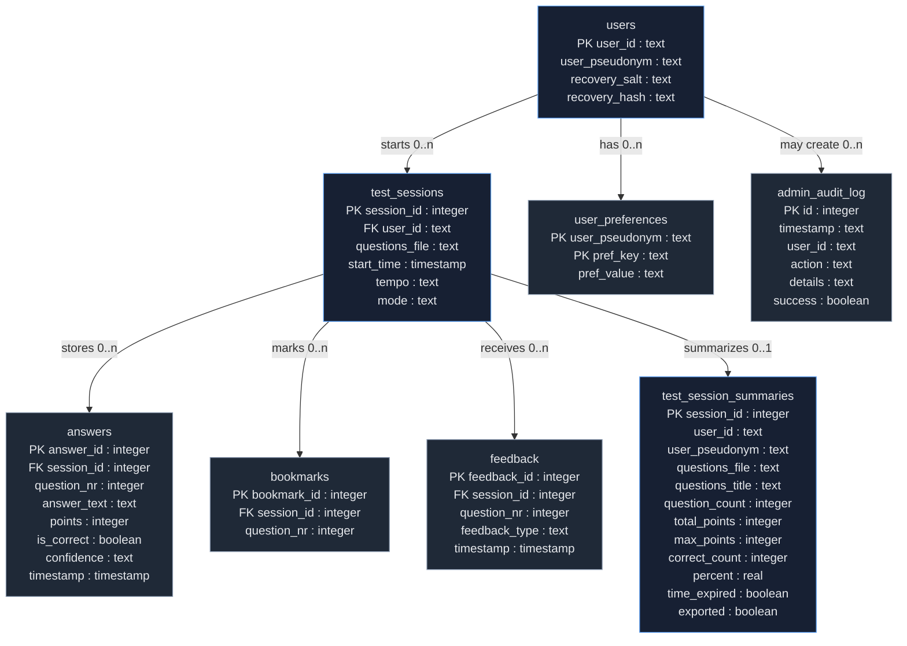
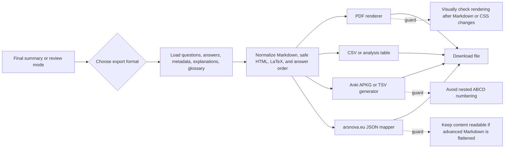
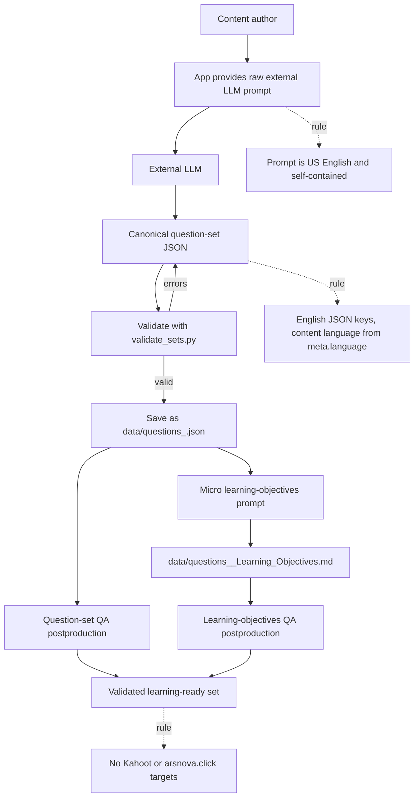
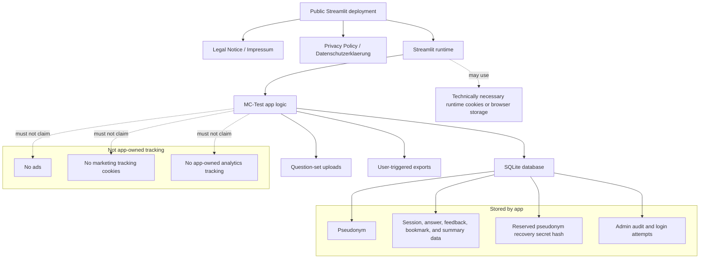
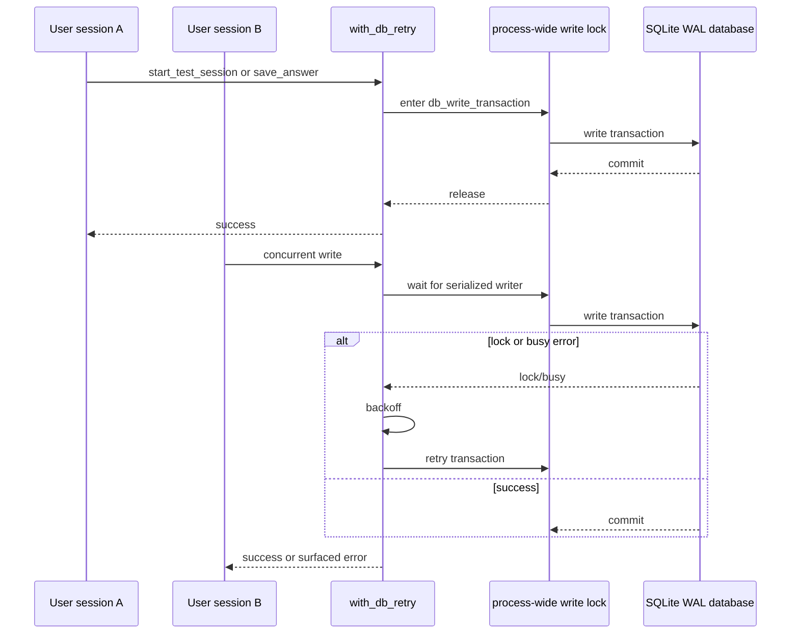

# MC-Test Mermaid Diagrams

This file collects Mermaid diagrams that describe MC-Test from product,
runtime, data, export, and governance perspectives. Mermaid diagrams are the
single source of truth for repository diagrams.

## 1) System Overview

## 2) Learner Journey

## 3) Test Session State Model

## 4) Answer Submission and Persistence

## 5) Data Model

This diagram intentionally uses a styled flowchart instead of Mermaid `erDiagram`
tables. Some renderers apply alternating ER row backgrounds that can become
unreadable in dark mode.

## 6) Export Pipeline

## 7) External LLM Content Workflow

## 8) Privacy and Legal Boundary

## 9) SQLite Write Path Under Load

