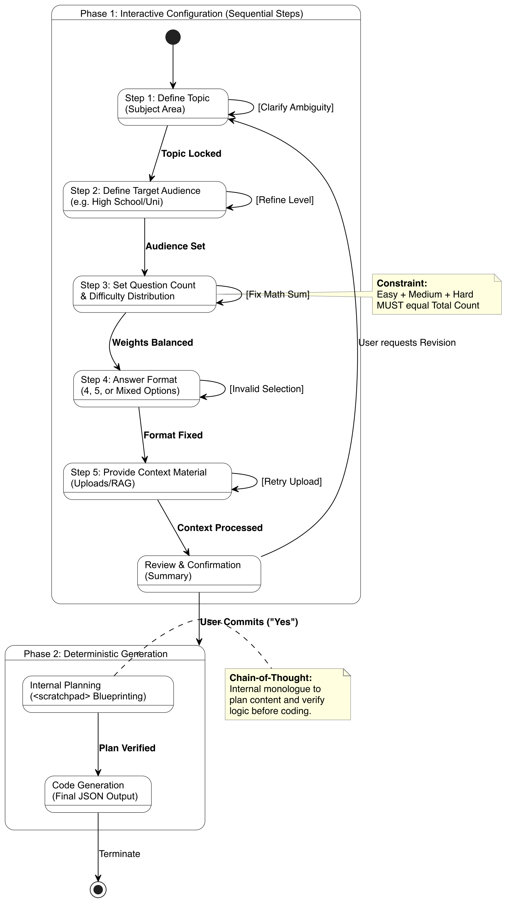

# Von summativen Multiple-Choice-Tests zu formativer Übung: KI-gestützte Fragengenerierung, kognitive Analysen und adaptive Taktung

**R. Bimberg, P. Kubica, K. Quibeldey-Cirkel**  
Technische Hochschule Mittelhessen (DEUTSCHLAND)  
IU Internationale Hochschule (DEUTSCHLAND)

## Zusammenfassung

Multiple-Choice-Prüfungen (MC) skalieren gut für große Kohorten, doch viele Plattformen liefern nur eine Punktzahl. Diese Arbeit stellt MC-Test vor, eine datenschutzkonforme Webplattform für formatives MC-Training, die LLM-gestützte Itemgenerierung mit strukturiertem Feedback, lernendenzentrierten Analysen und zeitbewusster Taktung verbindet.

MC-Test verwendet ein didaktisches Itemmodell, das jedes Item mit einem Lernziel, Thema, Gewichtung und einer operationalisierten kognitiven Stufe verknüpft. Die kognitiven Stufen sind auf Bloom‑Stufen 1–3 beschränkt (Reproduktion, Anwendung, Analyse). Items werden durch einen endlichen Prompt-Workflow erzeugt und als schema-valide JSON ausgegeben; automatisierte Validierung und Reparatur erhöhen die Robustheit und ermöglichen nachgelagerte Itemstatistiken.

Nach jeder Sitzung erhalten Lernende Begründungen für jede Antwortoption, ein Mini-Glossar sowie exportierbare Lernziele und Lernressourcen. Dashboards visualisieren die Leistung nach Thema und kognitiver Stufe. Verwendet werden Themenleistungsdiagramm, kognitives Radarprofil, Konzeptbeherrschungsspalten und Themen‑×‑Kognitiv‑Heatmap. Um Schnellraten zu reduzieren, wendet MC-Test konfigurierbare Wartezeiten vor und nach der Antwort an. Der Panikmodus lockert die Taktung, wenn die verbleibende Zeit pro Item kritisch wird. MC-Test läuft containerisiert auf institutionellen Servern mit lokalem LLM-Backend, sodass Prompts und Lerndaten innerhalb der institutionellen Infrastruktur verbleiben. Pseudonyme ermöglichen anonyme Teilnahme. Eine Pilot‑Usability‑Studie mit der System Usability Scale (SUS, N = 20) zeigt gute Akzeptanz mit einem Mittelwert von 70,38 (Adjektiv‑Kategorie „OK“ [15]). Die Plattform ist als Open‑Source‑Software unter MIT‑Lizenz verfügbar.

**Schlüsselwörter:** Künstliche Intelligenz in der Bildung, Multiple-Choice-Fragengenerierung, Bloom‑Taxonomie, lernendenzentrierte Lernanalysen, selbstreguliertes Lernen, Erkennung von Schnellraten, adaptive Taktung, datenschutzwahrende lokale Sprachmodelle, formative Bewertung.

## 1. EINLEITUNG

Multiple-Choice-Fragen (MC) werden an Hochschulen häufig eingesetzt, da sie gut skalieren, objektive Bewertung ermöglichen und sich in großen Kohorten leicht durchführen lassen. Typische MC-Plattformen liefern jedoch kaum mehr als eine Gesamtpunktzahl und itemweise Korrektheit. Dadurch entsteht wenig Unterstützung für metakognitive Reflexion und strategische Prüfungsvorbereitung. Lernende erhalten häufig Feedback, das zu grob ist, um Lernstrategien zu informieren. Gründe für Fehlleistungen bleiben damit häufig unklar.

Große Sprachmodelle (LLMs) können MC-Items in großem Umfang generieren. Dies verlagert den Engpass vom Verfassen zur Qualitätssicherung. Items müssen valide, angemessen schwierig und auf Lernziele abgestimmt sein. Wenn Metadaten wie Thema, Schwierigkeit und kognitive Stufe explizit erfasst werden, kann MC-Training lernendenzentrierte Analysen statt nur Punktzahlen liefern. Frühere Arbeiten zeigen, dass LLM-generierte MCQs in manchen Kontexten wettbewerbsfähige psychometrische Eigenschaften erreichen können. Sie unterstreichen aber die Notwendigkeit systematischer Validierung auf Itemebene, statt die Qualität allein aus der Generierung abzuleiten [2]. LLM-basierte Coding-Assistenten reduzieren zudem den Implementierungsaufwand und ermöglichen Fachexperten die Entwicklung maßgeschneiderter Bildungstools [1].

MC-Test ist eine webbasierte Plattform, die folgende Elemente kombiniert:

- Ein didaktisches Itemmodell, das jedes Item mit Lernzielen, Thema und kognitiven Stufenlabels gemäß Bloom‑Stufen 1–3 verknüpft.
- Eine LLM-Pipeline, die schema-valides JSON über eine endliche Zustandsinteraktion und automatisierte Validierung/Reparatur erzeugt.
- Lernendenzentrierte Analysen, die Leistung nach Thema und kognitiver Stufe visualisieren.
- Pädagogische Kontrollen in Form von Wartezeiten, Reflexionsfenstern und adaptiver Taktung zur Verringerung von Schnellraten.

MC-Test wurde zunächst mit kommerziellen LLM-APIs entwickelt und später zu einem lokalen LLM-Backend über Ollama migriert. Die Arbeit adressiert drei Forschungsfragen:

- **RQ1:** Wie können Klassifikationen kognitiver Stufen in einer lernendenzentrierten Bewertungsplattform operationalisiert werden?
- **RQ2:** Wie können LLMs über robustes Prompt-Engineering eingebettet werden, um psychometrische Qualitätsprüfungen und zuverlässige Itemgenerierung zu unterstützen?
- **RQ3:** Welche Designüberlegungen ergeben sich bei der Migration zu einem lokalen LLM-Backend?

Die Arbeit berichtet über Design und Implementierung von MC-Test und liefert erste Usability-Befunde (SUS, N = 20, Mittelwert = 70,38). Abschnitt 6 skizziert die geplante logbasierte Evaluation von Verhaltenseffekten, insbesondere Schnellraten, und lernbezogenen Ergebnissen. Die Hauptbeiträge sind:

- Operationalisierung der Bloom‑Stufen 1–3 in einem didaktischen Itemmodell und Darstellung durch vier lernendenzentrierte Ansichten (Themenleistungsdiagramm, kognitives Radardiagramm, Konzeptbeherrschungsspalten, Themen-×-Kognitiv-Heatmap) (RQ1).
- Implementierung einer kontextoptimierten, schema-beschränkten Itemgenerierungs-Pipeline (endliche Zustandsinteraktion + JSON-Validierung/Reparatur), die robuste Generierung und nachgelagerte psychometrische Prüfungen unterstützt (RQ2).
- Ableitung von Design- und Deployment-Erkenntnissen aus der Migration von kommerziellen APIs zu einem datenschutzwahrenden lokalen LLM-Backend (Ollama) in einer containerisierten On-Premises-Architektur mit Fokus auf Robustheit und Datensouveränität (RQ3).

MC-Test zielt auf formatives MC-Training in MINT-Fächern ab und beschränkt sich auf Bloom‑Stufen 1–3; höherstufige Aufgaben werden aufgrund aktueller LLM-Limitierungen ausgeschlossen [3]. Die Usability wurde in einer Pilotstudie erhoben (SUS = 70,38, Kategorie „OK“ [15]); Lerneffekte und Verhaltensänderungen erfordern Folgestudien (Abschnitt 6). Kognitive Labels werden doppelt codiert, und menschliche Itemprüfung bleibt obligatorisch. Die Taktung ist kurskonfigurierbar zur Unterstützung von Barrierefreiheit.

## 2. THEORETISCHER HINTERGRUND UND VERWANDTE ARBEITEN

**Kognitive Taxonomien und KI-Validität:** Die Bloom‑Taxonomie liefert seit langem einen Rahmen zur Differenzierung kognitiver Komplexität. Während LLMs gut darin sind, Inhalte für niedrigere taxonomische Stufen zu generieren (Erinnern, Verstehen), zeigen aktuelle Studien erhebliche Zuverlässigkeitsprobleme, wenn Modelle versuchen, Aufgaben für höherstufige Bewertung oder Kreation ohne Human-in-the-Loop-Verifikation zu erzeugen [3]. Daher erfordert automatisierte MC-Generierung strenge Einschränkungen zur Sicherstellung semantischer Validität [4].

**Lernendenzentrierte Lernanalysen und Selbstregulation:** Lernendenzentrierte Lernanalysen-Dashboards zielen darauf ab, Lernenden interpretierbare Visualisierungen zur Unterstützung selbstregulierten Lernens bereitzustellen [5]. Die Forschung legt jedoch nahe, dass reine Datenvisualisierung oft unzureichend ist. Effektive Systeme müssen aktive Anleitung oder Nudges bieten, um Erkenntnisse in Verhaltensänderung zu übersetzen [6]. Frühere Arbeiten liefern zudem Design- und Evaluierungsempfehlungen für lernendenzentrierte Lernanalysen-Dashboards [7]. MC-Test adressiert dies durch die Kombination von Analysen mit aktiven Taktungsmechanismen.

**Testbearbeitungsaufwand und Schnellraten:** Bei computergestützter Bewertung können ungewöhnlich kurze Antwortzeiten auf reduzierten Testbearbeitungsaufwand statt auf Wissensmangel hindeuten, etwa in Form von Schnellraten. Antwortzeit-Aufwandsmetriken und aufwandsmoderierte Modelle nutzen Antwortzeiten, um solche Antworten zu markieren oder abzuwerten, und liefern praktische Orientierung für die Festlegung von Antwortzeitenschwellen und die Interpretation von Schnellraten‑Indikatoren in Low-Stakes-Kontexten [8], [9].

**Datenschutz bei generativer KI:** Die Verwendung kommerzieller LLM-APIs in der Bildung wirft erhebliche Datenschutzbedenken bezüglich Datenlecks und DSGVO-Konformität auf [10]. Aktuelle Arbeiten heben das „Privacy Paradox" von LLMs hervor und legen nahe, dass On-Premises-Deployment (lokale LLMs) eine starke Minderungsoption für sensible Bildungskontexte darstellt [11].

## 3. SYSTEMDESIGN: DIE MC-TEST-PLATTFORM

### 3.1 Pädagogische Anforderungen

MC-Test wurde für formative Bewertung in MINT-Kursen konzipiert. Zentrale Anforderungen umfassten:

- **Kognitive Transparenz:** Items müssen nach kognitiver Stufe klassifiziert sein.
- **Umsetzbares Feedback:** Erklärungen müssen an Lernziele anknüpfen.
- **Prüfungsbereitschaft:** Unterstützung für Zeitmanagementfähigkeiten.
- **Didaktische Kontrolle:** Lehrende benötigen Kontrolle über die Itemqualität. Dazu gehören itemdiagnostische Hinweise wie Konfidenz‑Muster, die eine gezielte Überarbeitung missverständlicher Items unterstützen.

### 3.2 Systemarchitektur

Die Anwendung ist mit dem Python-Framework Streamlit implementiert und wurde von einem cloudbasierten Prototyp zu einer robusten, containerisierten Microservice-Architektur migriert. Der gesamte Stack wird über Docker Compose orchestriert und auf einem institutionellen On-Premises-Server bereitgestellt, um volle Datensouveränität zu gewährleisten. Zentrale Komponenten umfassen:

- **Datenpersistenz:** Eine PostgreSQL-Datenbank ersetzt leichtgewichtige dateibasierte Speicherung, um gleichzeitige Benutzersitzungen und komplexe relationale Daten (Benutzerprofile, Audit-Logs) zuverlässig zu verarbeiten.
- **Datenschutzkonforme Darstellung:** Um Datenlecks an externe Content Delivery Networks (CDNs) zu vermeiden, werden mathematische Formeln mit einer selbst gehosteten lokalen MathJax-Instanz dargestellt.
- **Lokale Inferenz-Engine:** Eine zentrale architektonische Änderung ist die Integration von Ollama als lokales LLM-Backend. Dies ermöglicht der Plattform, Open-Weight-Modelle vollständig innerhalb der Universitätsinfrastruktur auszuführen und stellt sicher, dass weder Studierendendaten noch Prompt-Logik die sichere Umgebung verlassen.

### 3.3 Didaktisches Datenmodell

Der Kern ist ein striktes JSON-Datenmodell. Zentrale Felder umfassen:

- `topic` und `learning_objective`
- `weight` (1–3) und `cognitive_level` (Reproduktion, Anwendung, Analyse)
- `mini_glossary`: Kontextuelle Definitionen zur Unterstützung von Just-in-Time-Lernen
- `rationales`: Detaillierte Erklärungen, warum jede Option korrekt oder inkorrekt ist
- Antwort‑Selbsteinschätzung vor der Abgabe in den Kategorien sicher und unsicher zur metakognitiven Analyse und Kalibrierung auf Itemebene

### 3.4 Taxonomie kognitiver Stufen für KI-generierte MCQs

MC-Test verwendet eine eingeschränkte dreistufige Taxonomie, inspiriert von der Bloom‑Taxonomie: (1) **Reproduktion** (Gewicht 1): Abruf von Fakten, Definitionen oder einfachen Algorithmen; (2) **Anwendung** (Gewicht 2): Anwendung bekannter Konzepte in leicht variierten Kontexten; und (3) **Analyse** (Gewicht 3): Interpretation von Daten, Vergleiche oder Schlussfolgerungen. Die Stufen 4–6 (Bewertung, Kreation) sind ausgeschlossen. Frühere Arbeiten berichten, dass aktuelle Modelle Schwierigkeiten haben, höherstufige Aufgaben in geschlossenen MC-Formaten zuverlässig zu validieren [3] und dass strikte Einschränkungen für semantisch valide MC-Generierung nötig sind [4]. Die Beschränkung auf Stufen 1–3 verbessert die Überprüfbarkeit und reduziert semantische Halluzinationen, aber menschliche Prüfung und Itemanalyse bleiben für faktische und psychometrische Qualität notwendig.

#### 3.4.1 Operationalisierung und Label-Zuverlässigkeit

Lernendenzentrierte Analysen erfordern stabile kognitive Stufenlabels. MC-Test operationalisiert daher Bloom‑Stufen 1–3 mit einer kurzen Rubrik und einem Verifikationsschritt. Der Workflow umfasst drei Schritte. Erstens spezifizieren Lehrende Lernziel und Zielstufe. Zweitens generiert das LLM ein Item und Begründungen, die auf dieses Ziel abgestimmt sind. Drittens prüfen Lehrende das Item vor Freigabe. Zur Quantifizierung der Label‑Zuverlässigkeit wird eine Stichprobe von zwei Lehrenden mit derselben Rubrik doppelt codiert. Es werden prozentuale Übereinstimmung und Cohens Kappa berichtet. Niedrige Übereinstimmung wird als Warnsignal behandelt, bevor kognitive Profile im großen Maßstab interpretiert werden.

### 3.5 Prompt-Architektur

Die Itemgenerierung wird durch einen kontextoptimierten Systemanweisungssatz gesteuert, der das Modell als „Interactive MCQ Generator" rahmt. Hier bezieht sich Kontextoptimierung auf das bewusste Design von (i) einem Interaktionsprotokoll, das alle Generierungsparameter erfragt, und (ii) harten Output-Einschränkungen, die Ergebnisse maschinenprüfbar machen.

MC-Test verwendet einen endlichen Zustandsworkflow mit drei Phasen. (1) **Konfiguration:** Das Modell sammelt Parameter schrittweise und fragt nach expliziter Bestätigung. Erfragt werden Thema, Zielgruppe, Itemanzahl, Schwierigkeits- und Gewichtsprofil, Optionsformat sowie optionaler curricularer Kontext. (2) **Interne Blaupausenerstellung:** Das Modell führt eine interne Konsistenzprüfung durch, etwa ob Schwierigkeitsgewichte dem angeforderten Profil entsprechen und Options- sowie Antworteinschränkungen erfüllbar sind, ohne Zwischenschritte offenzulegen. (3) **Schema-gesteuerte Ausgabe:** Das Modell gibt ein einzelnes, strikt parsbares JSON-Objekt zurück, das explizite Escape- und Formatierungsregeln befolgt, einschließlich stabiler `question_ids` und einer `schema_version` für Vorwärtskompatibilität. Der Workflow ist in Abb. 1 dargestellt.

Abb. 1: Endlicher Zustandsworkflow der Itemgenerierung.

Für Robustheit über Cloud- und lokale Backends hinweg wird das JSON einer automatisierten Schema- und semantischen Validierung unterzogen. Geprüft werden erforderliche Felder, eindeutige Optionen und gültige Antwortindizes. Optional folgt eine Reparaturschleife, die das Modell zu minimalen Änderungen auffordert, wenn Verstöße erkannt werden.

**Nachgelagerte Lernziele:** Nach der Generierung eines Fragensatzes schlägt das LLM eine kleine Menge von Themenlabels vor. In der Regel sind etwa zehn Labels ausreichend, um die Itembank zu strukturieren. Ein zweiter Prompt leitet Bloom‑ausgerichtete Lernziele pro Item aus Thema und kognitiver Stufe ab. Die Lernziele werden in einer lernendenzentrierten Lernressource kompiliert, die Ziele über Themen und Stufen hinweg zusammenfasst.

## 4. LERNENDENZENTRIERTE ANALYSEN UND PÄDAGOGISCHE KONTROLLE

Nach einem Test zeigt MC-Test ein lernendenzentriertes Analyse-Dashboard zur Unterstützung metakognitiver Reflexion. Statt einer einzelnen Punktzahl bietet es vier Ansichten, die curriculare Themen, kognitive Stufen und Konzeptbeherrschung abdecken. In diesem Abschnitt sind Themen grobe Curriculumseinheiten; Konzepte sind feinkörnige Lernziele innerhalb eines Themas.

Die vier Ansichten bilden einen diagnostischen Trichter von Überblick zu Detail. Die Heatmap unterstützt die Mustersuche über Thema × Stufe (einschließlich Vermeidung). Themenbalken und das Radar trennen Inhaltslücken von Prozesslücken, während die Konzeptspalten Muster in konkrete Förderungsziele übersetzen. Das Ziel ist, Lernende von globalen Selbsteinschätzungen zu umsetzbaren Diagnosen zu bewegen [12].

### 4.1 Themenleistungsdiagramm

Abb. 2 zeigt das Themenleistungsdiagramm, das Ergebnisse nach Themenbereich aggregiert, etwa Regression, Klassifikation oder Evaluation. Jeder gestapelte Balken zeigt korrekte, inkorrekte und unbeantwortete Items; die x-Achsenbeschriftungen berichten beantwortet/gesamt, um das Beweisvolumen anzuzeigen. Diese Ansicht hebt Themen hervor, die Förderung benötigen, und Themen, die möglicherweise übersprungen wurden.

Abb. 2: Themenleistungsdiagramm (Beispiel).

### 4.2 Kognitives Radardiagramm

Abb. 3 zeigt das kognitive Radardiagramm, das Leistung über die drei Stufen zusammenfasst. Es zeigt an, ob Lernende hauptsächlich Fakten abrufen oder Wissen übertragen und damit argumentieren können. Ausgewogene Formen deuten auf gleichmäßige Entwicklung hin; starke Asymmetrien heben gezielte Entwicklungszonen hervor. Zur Reflexion werden charakteristische Muster interpretativen, nicht-diagnostischen Lernendenarchetypen zugeordnet, etwa Theoretiker, Praktiker und Analytiker.

| | | |
|---|---|---|
|  |  |  |

Abb. 3: Kognitives Radardiagramm (Beispielprofile).

### 4.3 Konzeptbeherrschungsspalten

Abb. 4 zeigt die Konzeptbeherrschungsspalten. MC-Test gruppiert Items nach getaggten Konzepten, etwa Kreuzvalidierung oder Regularisierung, und klassifiziert jedes Konzept als verstanden, nicht verstanden oder nicht versucht. Ein Konzept gilt als verstanden, wenn mindestens 70 % seiner Items korrekt sind; andernfalls wird es markiert, um Missverständnisse sichtbar zu machen, ohne einzelne Items überzuinterpretieren. Diese Mikroebenen-Ansicht verwandelt Testergebnisse in konkrete Lernziele.

Abb. 4: Konzeptbeherrschungsspalten (Beispiel).

### 4.4 Themen-×-Kognitiv-Heatmap

Abb. 5 zeigt die Themen-×-Kognitiv-Heatmap, die Themen (Zeilen) und kognitive Stufen (Spalten) kombiniert. Zellen kodieren Leistung und Beweisvolumen: Unbeantwortete Items zählen als 0, und jede Zelle berichtet beantwortet/gesamt. Dies entmutigt strategisches Überspringen und hilft Lernenden zu lokalisieren, ob Schwierigkeiten themenspezifisch oder stufenspezifisch sind.

Abb. 5: Themen-×-Kognitiv-Heatmap (Beispiel).

Zusammen sind die Ansichten orthogonal. Themenleistung zeigt, was abgedeckt wurde; das Radar zeigt, wie der Lernende über Stufen hinweg abschneidet; die Heatmap verknüpft beide; und Konzeptbeherrschung zoomt in feinkörnige Ziele. Triangulation reduziert blinde Flecken und kann strategische Verhaltensweisen wie das Überspringen höherstufiger Items offenbaren. Abb. 6 zeigt eine exemplarische UI‑Ansicht der Plattform.

Abb. 6: Exemplarische UI‑Ansicht von MC‑Test.

### 4.5 Feedback und Erklärungen

Für komplexe Items werden Erklärungen um schrittweise Argumentation erweitert. Zur Unterstützung des Vokabularewerbs wird ein zweistufiges Glossarkonzept verwendet: ein Mini-Glossar-Feld für sofortige Hilfe und ein zusammenfassendes PDF-Glossar für die Nachbetrachtung.

Zusätzlich können Lernziele und der Testbericht als PDF exportiert werden. Diese Artefakte bündeln Ergebnisse, Begründungen und Lernziele und dienen der nachgelagerten Reflexion und Planung der nächsten Lernschritte.

### 4.6 Pädagogische Kontrolle: Wartezeiten und Panikmodus

MC-Test steuert die Taktung, um Lesen und Reflexion zu fördern und impulsive Antworten abzuschrecken. Die Taktungsinterventionen werden als Designhypothesen behandelt und ihre Verhaltenseffekte empirisch evaluiert, statt eine erzwungene tiefe Verarbeitung zu behaupten.

Die pädagogische Kontrollschicht bietet drei Mechanismen. **Pre‑Answer‑Wartezeit (Leseunterstützung):** Die Absende‑Schaltfläche bleibt nach dem Laden für eine kurze, itemspezifische Zeit deaktiviert; die Dauer hängt von Itemgewicht und Textlänge ab. **Post‑Answer‑Wartezeit (Reflexionsunterstützung):** Nach Abgabe wird die Navigation zum nächsten Item verzögert, um ein Prüfungsfenster für formatives Feedback zu schaffen [13]; die Dauer skaliert mit der Erklärungslänge (Standard plus zehn Sekunden, erweitert plus zwanzig Sekunden). **Adaptive Fairness (Panikmodus):** Taktung kann Lernende unter Zeitdruck behindern; das System kann Wartezeiten deaktivieren, wenn die Zeit kritisch wird.

Das System überwacht die verbleibende Zeit pro Frage. Fällt sie unter einen Schwellenwert, etwa weniger als 15 s pro Frage, überschreibt der Panikmodus Wartezeiten, sodass Lernende den Versuch beenden können. Da feste Taktung manche Lernende benachteiligen kann, etwa Nutzer von Hilfstechnologien oder Studierende mit Nachteilsausgleich, sind alle Wartezeiten pro Kurs konfigurierbar und können deaktiviert oder angepasst werden. Zusammenfassend priorisiert der Panikmodus Fertigstellung und Fairness bei hohem Zeitdruck.

### 4.7 Itemdiagnostik über Konfidenz-Matrix

Ergänzend zu lernendenzentrierten Dashboards stellt MC-Test eine instruktorenseitige Itemdiagnostik bereit. Pro Frage kann eine kumulierte Konfidenz‑Matrix angezeigt werden, die die Kategorien sicher und unsicher mit richtig und falsch kombiniert. Die Darstellung macht potenziell problematische Items sichtbar und unterstützt die Diagnose von Fehlkalibrierung, etwa wenn hohe Anteile sicher und falsch auf Missverständnisse oder fehlerhafte Lösungsschlüssel hinweisen. Die Aggregation schließt Autoreneinschätzungen aus, um Verzerrungen zu reduzieren. Der Zugriff ist rollenbasiert. Admins sehen die Matrix stets. Autorinnen und Autoren temporärer Sets sehen sie nur in der aktiven Session oder, bei reserviertem Pseudonym, innerhalb der Löschfrist.

## 5. IMPLEMENTIERUNG UND MIGRATION ZU LOKALEM LLM-BACKEND

Die Plattform wurde von kommerziellen Cloud-APIs zu einem institutionellen Server mit lokalem LLM-Backend (Ollama) migriert, um Datenschutz und Nachhaltigkeit zu adressieren.

- **Prompt-Refactoring:** Der Systemprompt wurde an lokale Modelleigenschaften angepasst und priorisiert JSON-Validität und Robustheit.
- **Datenschutz:** Lokales Deployment stellt sicher, dass keine Studierendendaten die Institution verlassen, entsprechend den Prinzipien von „Privacy by Design“ [10], [11].
- **Nachhaltigkeit:** On-Premises-Hosting mindert die Kosten und Rate-Limits kommerzieller API-Nutzung.
- **Datenminimierung und Logging:** Gespeichert wird nur, was für Bewertung und Analysen erforderlich ist (Antworten, Zeitstempel, aggregierte Punktzahlen) sowie minimale operative Metadaten und Sicherheits‑Audit‑Logs. Prompts vermeiden persönliche Identifikatoren, und das lokale Deployment hält sowohl Studierendendaten als auch Prompt‑Logik innerhalb der institutionellen Umgebung. Zugriff auf Logs und Datenbanken ist auf autorisiertes Personal beschränkt; Aufbewahrungsrichtlinien begrenzen die Speicherdauer.
- **Anonymität und Pseudonyme:** MC-Test unterstützt anonyme Teilnahme ohne persönliche Konten. Lernende wählen ein Pseudonym aus einer vordefinierten Liste, etwa Nobel‑ oder Turing‑Preisträger, um Sitzungsdaten für Fortschrittsanzeigen und aggregierte Analysen konsistent zu halten, ohne reale Identifikation zu ermöglichen.
- **Rollenbasierte Einsicht:** Itemdiagnostische Aggregationen sind ausschließlich für Admins sowie Autorinnen und Autoren sichtbar. Reguläre Lernende sehen keine Aggregationen.
- **Open-Source-Verfügbarkeit:** Zur Unterstützung von Transparenz und Reproduzierbarkeit wird die MC-Test-Streamlit-Anwendung unter MIT-Lizenz veröffentlicht; das Repository enthält Deployment- und Konfigurationsdokumentation, etwa Docker Compose, sowie die schema-gesteuerten Artefakte, die in der lokalen Inferenz-Pipeline verwendet werden.

## 6. EVALUIERUNGSDESIGN UND AUSBLICK

### 6.1 Geplantes Studiendesign

Geplant sind Piloteinsätze in MINT‑Modulen. Erhoben werden Systemlogs, darunter Taktungsentscheidungen, kognitive Profile und Antwortzeiten, sowie Vor‑ und Nach‑Fragebögen zu metakognitivem Bewusstsein und wahrgenommener Nützlichkeit. Ergänzend werden Interviews durchgeführt. Darauf folgen vergleichende Designs, etwa A/B‑Studien oder phasenweise Einführungen, um zu prüfen, ob pädagogische Kontrolle Schnellraten‑Indikatoren reduziert und Lernstrategien oder Lernergebnisse verändert. Zusätzlich wird Labelstabilität geprüft, und es werden grundlegende Itemstatistiken zur Unterstützung psychometrischer Interpretation berichtet.

Schnellraten‑Indikatoren werden aus Logs abgeleitet, darunter Antwortzeiten unter itemspezifischen Schwellenwerten, Antwortraten mit geringem Bearbeitungsaufwand pro Lernendem und Antwortzeitveränderungen vor und nach Taktung [8], [9]. Bedingungen werden verglichen, etwa aktivierte versus deaktivierte Taktung sowie gestaffelte Einführung, mit Kontrolle für Itemschwierigkeit und Position. Untersucht wird außerdem nachgelagertes Verhalten wie Feedback‑Betrachtungszeit und Optionsprüfung.

Zusätzlich ist geplant, kumulierte Konfidenz-Muster als Indikatoren der Itemdiagnostik zu analysieren und mit klassischen Itemstatistiken zu triangulieren, um potenziell missverständliche Items früh zu markieren.

Zur Sicherung der Interpretierbarkeit werden kognitive Stufenlabels als messbare Designannahme behandelt. Die Labels werden mit einer Rubrik doppelt codiert, und es wird Interrater‑Übereinstimmung berichtet, darunter prozentuale Übereinstimmung und Cohens Kappa. Zusätzlich werden grundlegende Itemstatistiken, etwa Schwierigkeit und Diskrimination, berechnet, um Items niedriger Qualität oder mehrdeutige Items zu markieren, bevor kognitive Profile im großen Maßstab interpretiert werden.

Vorläufige Beobachtungen deuten darauf hin, dass Lernende die Aufschlüsselung nach kognitiver Stufe und transparente Begründungen schätzen. Feedback zur Taktung war gemischt und motivierte den später hinzugefügten adaptiven Panikmodus. Diese Beobachtungen sind explorativ; vorgesehen sind kontrollierte Vergleiche unter Nutzung von Verhaltenslogs und selbstberichteten Maßen.

### 6.2 Vorläufige Ergebnisse: Systemusability

Um die Benutzererfahrung (UX) und technische Akzeptanz der Plattform zu validieren, wurde eine standardisierte Usability-Evaluation mit der System Usability Scale (SUS) [14] durchgeführt. Die Umfrage wurde an einer Pilotkohorte von 20 Teilnehmenden durchgeführt und ergab einen mittleren SUS-Score von 70,38.

Nach der Adjektiv‑Bewertungsskala von Bangor et al. [15] liegt der mittlere SUS‑Score von MC‑Test in der Kategorie „OK“, was auf gute Akzeptanz hindeutet. Abb. 7 zeigt individuelle Scores im Verhältnis zu Akzeptabilitätsbändern („Acceptable“, „Good“, „Excellent“) und weist eine linksschief verteilte Verteilung aus. Die meisten Teilnehmenden bewerteten das System als einfach zu bedienen, mit einigen niedrigeren Ausreißern.

Abb. 7: SUS-Score-Verteilung der Pilotstudie.

Wichtig ist, dass SUS primär wahrgenommene Usability erfasst; es etabliert keine Lernvorteile oder Verhaltenseffekte. Diese Aspekte werden in nachfolgenden Studien unter Verwendung logbasierter Schnellraten‑Indikatoren, Lernendenfeedback zu Fairness und Autonomie sowie, soweit möglich, Lernergebnismaßen untersucht.

### 6.3 Limitationen

Dieses Paper trägt ein Systemdesign und vorläufige Usability‑Befunde bei. Erstens erfordern die intendierten Vorteile kognitiven Profilings und der Taktungsunterstützung empirische Validierung über SUS hinaus, etwa reduziertes Schnellraten und verbesserte metakognitive Regulation. Zweitens sind kognitive Stufenlabels interpretativ; Zuverlässigkeitsprüfungen durch Doppelcodierung und psychometrische Itemanalysen sind notwendig, bevor lernendenzentrierte Analysen im großen Maßstab interpretiert werden. Drittens können Taktungsmechanismen Lernendenautonomie und Barrierefreiheit beeinflussen; Kurse sollten Konfigurationsoptionen und Nachteilsausgleichswege bereitstellen, um unbeabsichtigte Benachteiligungen zu vermeiden.

Aktuelle Studien bewerten die psychometrischen Eigenschaften LLM-generierter Fragen und verstärken die Notwendigkeit, Itemstatistiken auf Einzelitemebene zu berichten, wenn KI-generierte MCQs in der Praxis verwendet werden [2]. Über klassische Itemanalyse hinaus kann zukünftige Arbeit auch generative Studierenden‑Simulationen nutzen, um mehrdeutige oder niedrig diskriminierende Items vor Einsatz zu markieren [16].

## 7. FAZIT

MC-Test demonstriert, wie LLM-gestützte Itemgenerierung in eine formative Multiple-Choice-Übungsplattform integriert werden kann, ohne Lerndaten auszulagern. Das System kombiniert (i) ein didaktisches Itemmodell mit Labels der Bloom‑Stufen 1–3, (ii) schema-beschränkte Generierung über einen endlichen Zustandsworkflow und (iii) lernendenzentrierte Dashboards, die Leistung mit Lernzielen über Themen und kognitive Stufen hinweg verbinden. Eine konfigurierbare Taktungsschicht (Vor-/Nach-Antwort-Wartezeiten, Panikmodus) zielt auf Schnellraten ab und bewahrt gleichzeitig Fairness unter Zeitdruck.

Die Beiträge sind dreifach: (1) ein operationales didaktisches Itemmodell, das Lernziele, kognitive Stufen und formative Begründungen koppelt; (2) eine robuste Generierungspipeline, die parsbares JSON produziert und automatisierte Prüfungen unterstützt; und (3) eine On‑Premises‑Architektur für lokale, schema‑beschränkte LLM‑Inferenz mit Ollama, geeignet für datenschutzsensible Lehrumgebungen. Eine Pilot‑Usability‑Studie zeigt gute Akzeptanz (SUS 70,38, N = 20). Laufende Arbeiten evaluieren Verhaltenseffekte, Labelzuverlässigkeit und Item‑Psychometrie mittels vergleichender und logbasierter Studien.

## LITERATUR

[1] T. Weber, M. Brandmaier, A. Schmidt, and S. Mayer, "Significant Productivity Gains through Programming with Large Language Models," Proc. ACM Hum.-Comput. Interact., vol. 8, EICS, Art. 256, 2024, doi:10.1145/3661145.

[2] S. Bhandari, Y. Liu, Y. Kwak, and Z. A. Pardos, "Evaluating the psychometric properties of ChatGPT-generated questions," Computers and Education: Artificial Intelligence, vol. 7, Art. 100284, 2024, doi: 10.1016/j.caeai.2024.100284.

[3] N. Scaria, S. D. Chenna, and D. Subramani, "Automated Educational Question Generation at Different Bloom's Skill Levels Using Large Language Models: Strategies and Evaluation," in Artificial Intelligence in Education (AIED 2024), LNAI vol. 14830, pp. 165-179, 2024, doi: 10.1007/978-3-031-64299-9_12.

[4] P. Stalder, et al., "Ensuring Quality in AI-Generated Multiple-Choice Questions for Higher Education with the QUEST Framework," in Communications in Computer and Information Science, Springer, 2024.

[5] R. Bodily and K. Verbert, "Trends and issues in student-facing learning analytics reporting systems research," in Proc. 7th Int. Conf. Learning Analytics & Knowledge (LAK '17), Vancouver, BC, Canada, Mar. 2017, pp. 309-318, doi: 10.1145/3027385.3027403.

[6] L. de Vreugd, et al., "Learning Analytics Dashboard Design and Evaluation to Support Student Self-Regulation of Study Behavior," Journal of Learning Analytics, vol. 11, no. 3, 2024.

[7] I. Jivet, M. Scheffel, M. Specht, and H. Drachsler, "License to evaluate: Preparing learning analytics dashboards for educational practice," in Proc. 8th Int. Conf. Learning Analytics & Knowledge (LAK '18), Sydney, NSW, Australia, Mar. 2018, pp. 31-40, doi: 10.1145/3170358.3170421.

[8] S. L. Wise and C. E. DeMars, "An application of item response time: The effort-moderated model," Journal of Educational Measurement, vol. 43, pp. 19-38, 2006.

[9] S. L. Wise, "Rapid-guessing behavior: Its identification, interpretation, and implications," Educational Measurement: Issues and Practice, vol. 36, no. 4, pp. 52-61, 2017, doi:10.1111/emip.12165.

[10] H. Drachsler and W. Greller, "Privacy and Analytics: It's a DELICATE Issue-A Checklist for Trusted Learning Analytics," in Proceedings of the Sixth International Conference on Learning Analytics & Knowledge, Edinburgh, UK, 2016, pp. 89-98.

[11] Y. Shanmugarasa, M. Ding, M. A. P. Chamikara, and T. Rakotoarivelo, "SoK: The Privacy Paradox of Large Language Models: Advancements, Privacy Risks, and Mitigation," arXiv preprint arXiv:2506.12699, 2025.

[12] Z. Yan and D. Carless, "Self-Assessment Is About More Than Self: The Enabling Role of Feedback Literacy," Assessment & Evaluation in Higher Education, vol. 47, no. 7, pp. 1116-1128, 2022.

[13] N. E. Winstone and D. Carless, Designing Effective Feedback Processes in Higher Education: A Learning-Focused Approach. London: Routledge, 2019.

[14] J. Brooke, "SUS: A 'Quick and Dirty' Usability Scale," in Usability Evaluation in Industry, P. W. Jordan, B. Thomas, B. A. Weerdmeester, and I. L. McClelland, Eds. London, U.K.: Taylor & Francis, 1996, pp. 189-194.

[15] A. Bangor, P. T. Kortum, and J. T. Miller, "Determining what individual SUS scores mean: Adding an adjective rating scale," Journal of Usability Studies, vol. 4, no. 3, pp. 114-123, 2009.

[16] X. Lu and X. Wang, "Generative Students: Using LLM-Simulated Student Profiles to Support Question Item Evaluation," in Proc. 11th ACM Conf. on Learning @ Scale (L@S '24), 2024, pp. 16-27, doi: 10.1145/3657604.3662031.
