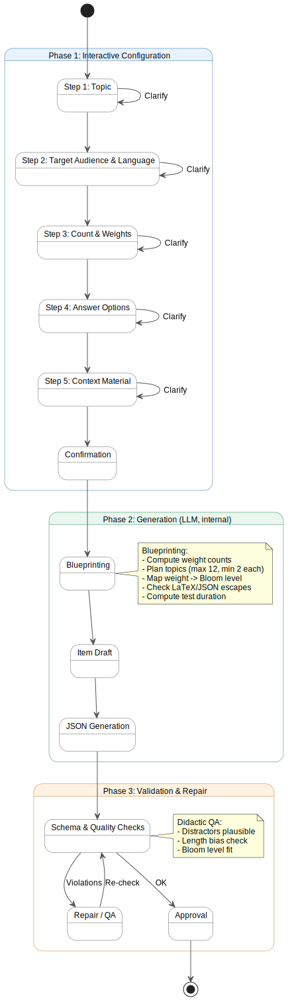
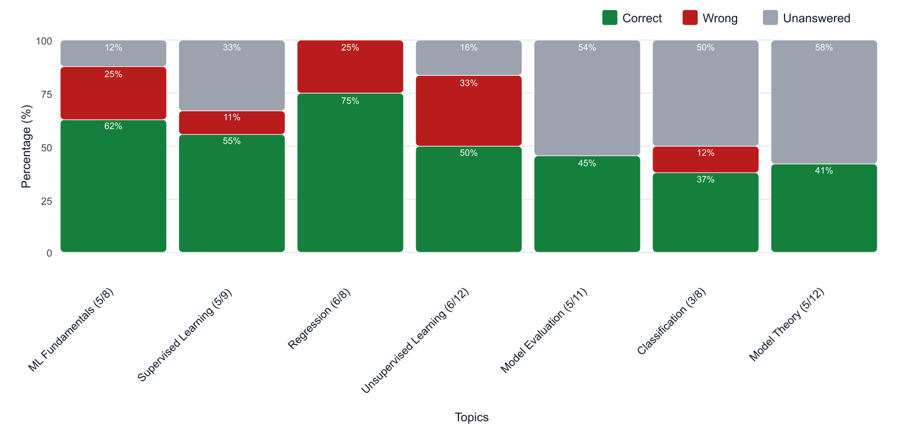
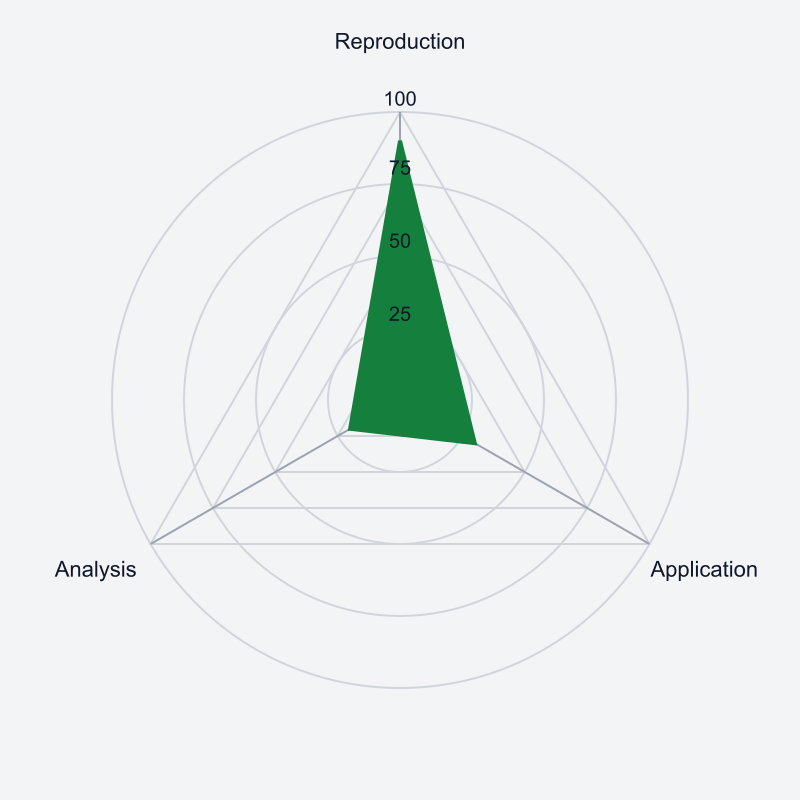
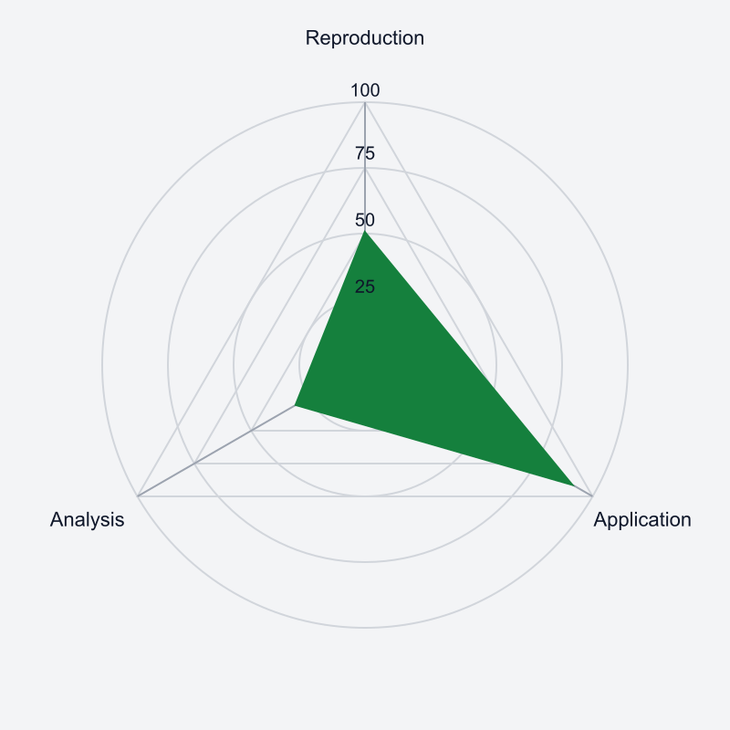
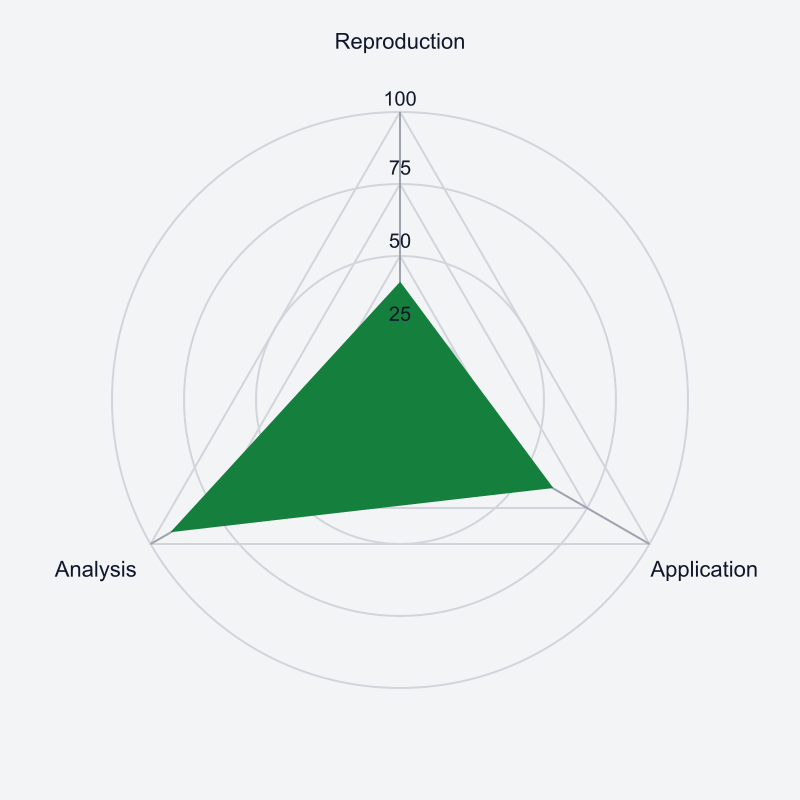
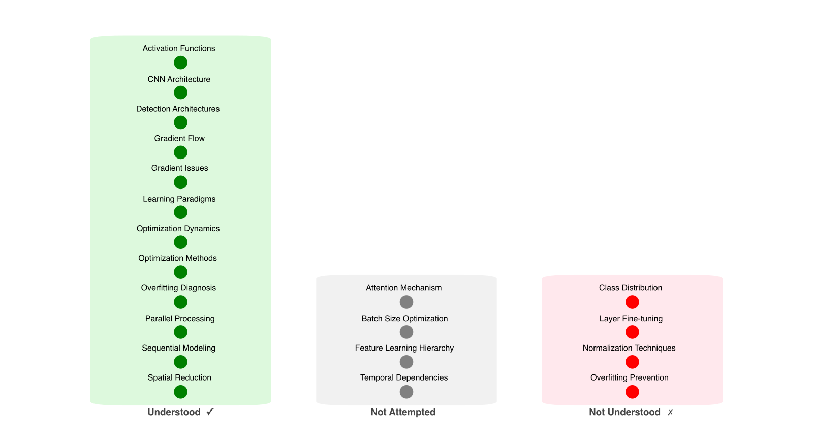
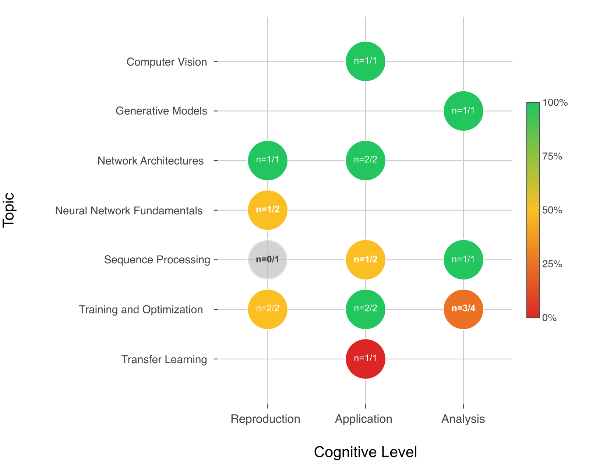
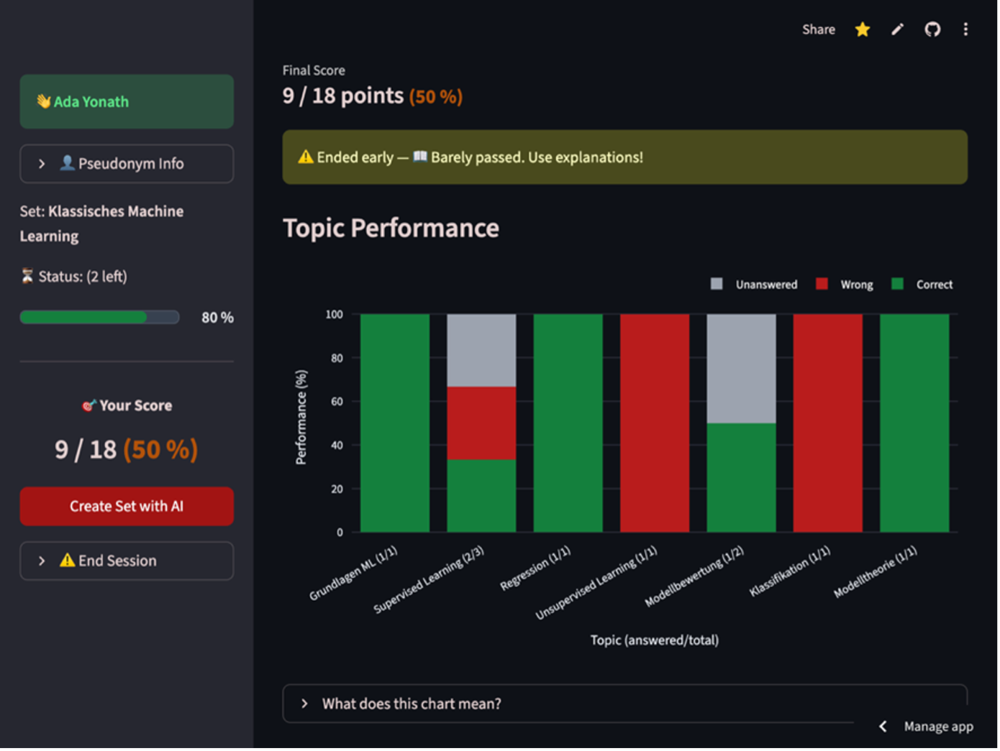
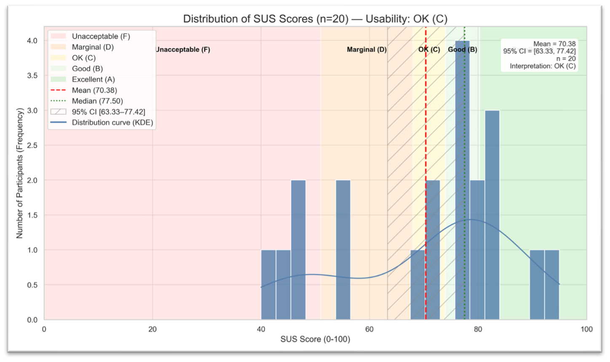

# Von summativen Multiple-Choice-Prüfungen zur formativen Übung: KI-gestützte Item-Generierung, kognitive Lernanalytik und adaptives Pacing

**R. Bimberg, P. Kubica, K. Quibeldey-Cirkel**  
Technische Hochschule Mittelhessen (Deutschland); IU Internationale Hochschule (Deutschland)

## Zusammenfassung

Multiple-Choice-(MC-)Prüfungen sind in großen Kohorten effizient. In der Praxis endet die Rückmeldung jedoch oft bei einer Punktzahl. Lernende sehen zwar richtige und falsche Antworten, erhalten aber wenig Hilfe dabei, Wissenslücken zu verstehen, Lernziele abzuleiten und ihre Prüfungsvorbereitung zu steuern.

Wir stellen **MC-Test** vor, eine Webplattform für **formative MC-Übungssitzungen**. MC-Test kombiniert (1) ein didaktisches Itemmodell (Lernziele, Topics, Bloom-Stufen 1–3), (2) eine robuste, schema-gebundene LLM-Pipeline zur Item-Erzeugung und (3) lernendenzentrierte Dashboards, die Leistung nach Topic und kognitiver Stufe sichtbar machen. Nach jeder Sitzung erhalten Lernende Begründungen zu *jeder* Antwortoption sowie ein Mini-Glossar. Um impulsives Klicken und **Rapid Guessing** zu reduzieren, ergänzt MC-Test pädagogische Tempo-Steuerungen (Pre-Answer-Cooldown, Reflexionsfenster) und einen konfigurierbaren **Panikmodus**.

MC-Test entstand zunächst mit kommerziellen LLM-APIs und wurde anschließend auf ein lokales LLM-Backend (**Ollama**) migriert, sodass Prompts und Lerndaten innerhalb der institutionellen Infrastruktur verbleiben. Eine erste Usability-Erhebung (SUS, *N* = 20) ergibt einen Mittelwert von **70,38** (Kategorie „OK“). Weitere Arbeit fokussiert eine logbasierte Wirkungsanalyse sowie vertiefte psychometrische Prüfungen der generierten Items.

**Schlüsselwörter:** KI in der Hochschullehre; Multiple-Choice; Item-Generierung; Bloom-Taxonomie; Lernanalytik; formative Bewertung; Datenschutz; lokale Sprachmodelle.

## 1. Einleitung

MC-Fragen sind in der Hochschullehre verbreitet, weil sie objektiv auswertbar sind und große Gruppen abdecken. Viele Plattformen liefern jedoch vor allem **Summenwerte**. Dadurch bleibt häufig unklar, *warum* Lernende Fehler machen und *woran* sie gezielt arbeiten sollten.

Große Sprachmodelle (LLMs) können MC-Items heute in großer Menge erzeugen. Damit verschiebt sich der Engpass von der Erstellung zur **Qualitätssicherung**: Items müssen formal korrekt, fachlich stimmig, angemessen schwierig und didaktisch passend sein. Gleichzeitig werfen kommerzielle LLM-APIs im Bildungsbereich Fragen zu Datenschutz, Governance und Kosten auf.

Vor diesem Hintergrund entwickeln wir **MC-Test**, eine Webplattform für formative MC-Übung, die drei Bausteine integriert:

- **Didaktisches Itemmodell** mit Lernzielen, Topics und Bloom-Labels (1–3),
- **robuste LLM-Generierungspipeline** (Schema-Constraints, Validierung, Repair),
- **lernendenzentrierte Analysen** (Dashboards) für Reflexion und Selbstregulation,
  ergänzt um **Pacing** (Cooldowns, Reflexionsfenster, Panikmodus).

### Forschungsfragen

- **RQ1:** Wie lassen sich kognitive Niveaus (Bloom 1–3) so operationalisieren, dass sie in einer lernendenzentrierten Assessment-Plattform interpretierbar und nutzbar werden?
- **RQ2:** Wie können LLMs mittels robuster Prompt-Architektur (Schema-Constraints, Validierung, Repair) verlässlich in Item-Generierung und Qualitätsprüfung eingebettet werden?
- **RQ3:** Welche Design- und Betriebserfahrungen ergeben sich bei der Migration von kommerziellen APIs zu einem lokalen LLM-Backend (Ollama) in einer On-Premises-Architektur?

### Beiträge

1. **Operationalisierung** von Bloom 1–3 in einem didaktischen Itemmodell und Bereitstellung über vier Analyse-Views (RQ1).
2. **Implementierung** einer kontext-engineerten, schema-gebundenen Generierungspipeline (Finite-State-Interaktion + JSON-Validierung/Repair) als Grundlage für nachgelagerte Qualitätschecks (RQ2).
3. **Ableitung** von Design- und Deployment-Lessons aus der Migration zu einem lokalen, privacy-preserving LLM-Backend (Ollama) in containerisiertem On-Premises-Betrieb (RQ3).

MC-Test ist ein Tool für formative Übungsszenarien, insbesondere in den MINT-Fächern. Wir fokussieren Bloom 1–3. Höhere Stufen sind im MC-Format und im Kontext aktueller LLMs weniger verlässlich abbildbar.

## 2. Theoretischer Hintergrund und Related Work

**Bloom-Taxonomie und Validität KI-generierter Items.** Bloom’s Taxonomie dient zur Einordnung kognitiver Komplexität. Für KI-generierte Items ist entscheidend, Bloom-Labels nicht nur zu behaupten, sondern transparent zu operationalisieren und empirisch zu prüfen (z. B. via Expert:innen-Ratings und psychometrische Analysen) [3], [5].

**Learner-Facing Learning Analytics und Selbstregulation.** Lernanalytik-Dashboards unterstützen Planung, Monitoring und Reflexion, wenn sie verständlich sind und konkrete Handlungen nahelegen. Relevante Gestaltungsprinzipien betreffen Interpretierbarkeit, Handlungsbezug und die Einbettung in Lernprozesse [6]–[8].

**Rapid Guessing und Testanstrengung.** Sehr kurze Antwortzeiten sind ein etablierter Hinweis auf reduzierte Anstrengung. In Low-Stakes-Kontexten sind sowohl Interface-Interventionen als auch logbasierte Indikatoren zur Identifikation von Rapid Guessing sinnvoll [9], [10].

**Datenschutz in generativer KI.** Kommerzielle LLM-APIs können Risiken durch Datenabfluss, unklare Datenverarbeitung und Abhängigkeiten (Kosten, Rate Limits) erzeugen. Lokale Deployments sind eine praktikable Privacy-by-Design-Option, erfordern jedoch Governance für Modell- und Sicherheitsupdates [11], [12].

## 3. Systemdesign: die Plattform MC-Test

### 3.1 Pädagogische Anforderungen

MC-Test ist für formative Übungssituationen gebaut. Das System soll Lernenden nicht nur Ergebnisse zeigen, sondern **verständliches Feedback** liefern und **Selbstregulation** unterstützen. Daraus ergeben sich fünf Anforderungen:

- **Kognitive Transparenz:** Items tragen ein Bloom-Label (1–3), das Lernende im Dashboard nutzen können.
- **Umsetzbares Feedback:** Erklärungen verknüpfen Antworten mit Lernzielen und typischen Fehlkonzepten.
- **Prüfungsbereitschaft:** Die Sitzung unterstützt Zeitmanagement und reflektiertes Bearbeiten.
- **Didaktische Kontrolle:** Lehrende konfigurieren Tempo-Mechanismen (Cooldowns/Reflexionsfenster) und Schwellenwerte.
- **Messbarkeit:** Logs und strukturierte Itemdaten ermöglichen nachgelagerte Analysen und Iteration.

Wir beschränken uns bewusst auf Bloom 1–3 (Reproduktion, Anwendung, Analyse), weil höhere Niveaus im Kontext aktueller LLMs und im MC-Format weniger zuverlässig abbildbar sind [3].

### 3.2 Systemarchitektur

MC-Test ist als Webanwendung in **Streamlit** umgesetzt. Die Plattform verwaltet Item-Sets, Sitzungen, Antwort-Logs und Exporte. Für die Generierung bindet MC-Test ein LLM-Backend an. Nach der Migration läuft dieses Backend lokal über **Ollama** im containerisierten On-Premises-Betrieb.

Diese Architektur erfüllt zwei Ziele: (1) sie reduziert Datenschutzrisiken, weil Prompts und Lerndaten im institutionellen Netz bleiben, und (2) sie macht Betriebskosten besser planbar. Gleichzeitig entstehen neue Betriebsaufgaben (Monitoring, Ressourcenplanung, Update-Governance).

### 3.3 Didaktisches Datenmodell

Jedes Item enthält:

- **Lernziel(e)**,
- **Topic-Label(s)**,
- **Gewichtung**,
- **Bloom-Level (1–3)**,
- **Antwortoptionen** (inkl. korrekter Option),
- **Erklärungen/Rationales** zu jeder Option,
- optional **Mini-Glossar** und Ressourcen-Hinweise.

Das Modell dient zwei Zwecken zugleich: Es begrenzt die Generierung über ein Schema (Robustheit) und ermöglicht differenzierte, lernendenzentrierte Analytik.

### 3.4 Operationalisierung kognitiver Niveaus

Wir operationalisieren Bloom 1–3 mit konkreten sprachlichen und strukturellen Kriterien:

- **Bloom 1 (Reproduktion):** Abruf von Fakten/Definitionen; Distraktoren prüfen Grundwissen.
- **Bloom 2 (Anwendung):** Anwendung eines Konzepts auf ein Beispiel oder eine Rechen-/Code-Situation.
- **Bloom 3 (Analyse):** Analyse eines Szenarios (z. B. Fehlerdiagnose, Vergleich, Ursache-Wirkung) mit begründeter Auswahl.

Die Labels werden im Interface sichtbar gemacht und als Designannahme behandelt. Für die geplante Evaluation sichern wir die Reliabilität über **Double-Coding** und klar dokumentierte Label-Regeln.

### 3.5 Prompt-Architektur

Die Item-Generierung folgt einer endlichen Interaktionssequenz (**Finite-State-Workflow**):

1. **Kontextaufbau** (Kurs/Topic/Lernziel, gewünschtes Bloom-Level),
2. **Item-Entwurf**,
3. **Schema-Validierung** des JSON-Ergebnisses,
4. **Repair** bei Verstößen (gezielte Nachbesserung statt Neu-Generierung).

Das Ergebnis ist strikt JSON-konform. Dadurch lassen sich nachgelagerte Checks automatisieren (z. B. Distraktorqualität, Konsistenz zwischen Frage und Erklärung).

Der Workflow ist in Abb. 1 dargestellt.

*Abb. 1. Endlicher Zustandsworkflow der Itemgenerierung.*

## 4. Learner-Facing Analytics und pädagogische Steuerung

Die Dashboards bilden einen „Trichter“: Sie beginnen mit Überblick und führen zu konkreten Handlungen. Alle Views sind so gestaltet, dass Lernende sofort sehen, *was* sie wiederholen sollten und *warum*.

### 4.1 Topic Performance

Gestapelte Balken zeigen pro Topic den Anteil korrekter, falscher und nicht beantworteter Items. So können Lernende Themen priorisieren und Wiederholungen planen.

*Abb. 2. Topic-Performance-Chart: Leistung nach Themen, getrennt nach korrekt/falsch/unbeantwortet.*

### 4.2 Kognitives Radar

Radar-Charts fassen Leistung über Bloom 1–3 zusammen. Sie machen ein „kognitives Profil“ sichtbar: Lernende erkennen, ob sie vor allem Reproduktion beherrschen oder auch Anwendung/Analyse stabil gelingt.

| | | |
|---|---|---|
|  |  |  |

*Abb. 3. Kognitives Radar: Beispielhafte Performance über Bloom 1–3 (Reproduktion, Anwendung, Analyse).*

### 4.3 Konzept-Spalten

Feingranulare Konzepte werden in drei Spalten gruppiert: **verstanden**, **nicht verstanden** und **nicht versucht**. Schwellenwerte sind kurskonfigurierbar. Die Darstellung erleichtert es, aus Ergebnissen konkrete Lernschritte abzuleiten.

*Abb. 4. Konzept-Spalten: Gruppierung feingranularer Konzepte in verstanden, nicht versucht und nicht verstanden.*

### 4.4 Topic×Cognitive-Heatmap

Die Heatmap kombiniert Topics (Zeilen) und Bloom-Levels (Spalten). Farbcodierung zeigt Performance, Overlays die Item-Anzahl pro Zelle. Lernende sehen damit schnell, *wo* es Defizite gibt und *welche kognitive Art* von Aufgaben besonders schwierig ist.

*Abb. 5. Topic×Cognitive-Heatmap (Topics × Bloom-Level) mit farbcodierter Performance und Item-Anzahlen.*

### 4.5 Feedback und Erklärungen

Nach jeder Sitzung liefert MC-Test Erklärungen zu jeder Antwortoption. Lernende erhalten so nicht nur „richtig/falsch“, sondern eine Begründung, die an Lernziele und typische Misskonzepte anschließt. Zusätzlich können Lernziele, Topics und Ressourcen exportiert werden.

### 4.6 Pacing

MC-Test reduziert Rapid Guessing durch zwei Mechanismen:

- **Pre-Answer-Cooldown:** ein kurzes Lesefenster vor der ersten Antwort (Lesesupport).
- **Reflexionsfenster:** kurze Wartezeit nach einer Antwort, die Reflexion erzwingt.

Der **Panikmodus** erlaubt es, Pacing in Zeitdrucksituationen zu deaktivieren. Alle Parameter sind kurskonfigurierbar (Barrierefreiheit, unterschiedliche Kurskulturen). Ziel ist nicht „Strafe“, sondern ein *Nudge* zu reflektiertem Bearbeiten.

*Abb. 6. MC-Test-Oberfläche: Sitzungsfeedback und Topic-Performance im Dashboard.*

*Neben den lernerzentrierten Dashboards braucht es auch Itemdiagnostik: Nur so lassen sich fehlerhafte oder missverständliche Fragen früh erkennen und gezielt überarbeiten.*

### 4.7 Itemdiagnostik über Konfidenz-Matrix

Für Lehrende und Itemautor:innen bietet MC-Test zusätzlich eine **Konfidenz-Matrix**, die Antwortverhalten pro Item diagnostisch verdichtet. Sie verbindet **Korrektheit** mit der vom Lernenden angegebenen **Konfidenz** und ordnet Antworten in vier Felder ein: *(korrekt/hoch), (korrekt/niedrig), (falsch/hoch), (falsch/niedrig)*.

Diese Darstellung unterstützt gezielte Itemrevision:

- **falsch + hoch**: Hinweis auf Fehlkonzepte, missverständliche Formulierungen oder irreführende Distraktoren.  
- **korrekt + niedrig**: Hinweis auf Raten oder fragile Kenntnisse (Item ist ggf. zu unsicher formuliert oder Feedback zu knapp).  
- **falsch + niedrig**: typischer Lernbedarf; Erklärungstext und Konzeptbezug sollten besonders klar sein.  
- **korrekt + hoch**: stabil beherrschter Stoff; Item kann als Referenz dienen.

Die Matrix ist **rollenbasiert** und zeigt ausschließlich **aggregierte** Kennwerte (keine Einzelverläufe). Autor:innen können aus der Matrix in die Itemdetails springen (Topic, Bloom-Stufe, Distraktoren, Erklärung), um Änderungen nachvollziehbar zu begründen.

## 5. Implementierung und Migration zum lokalen LLM-Backend

MC-Test wurde zunächst mit kommerziellen LLM-APIs prototypisiert und anschließend auf ein lokales LLM-Backend migriert. Diese Migration war mehr als ein „Backend-Tausch“: Sie erforderte Prompt-Refactoring (stärkere Fokussierung auf JSON-Validität), robuste Fehlerbehandlung sowie Anpassungen im Deployment.

On-Premises-Betrieb stärkt Datenschutz, senkt variable Kosten und reduziert Abhängigkeiten von Rate Limits. Gleichzeitig steigt die Verantwortung für Betrieb und Qualität: Monitoring, Ressourcenplanung und Governance für Modellupdates werden zentral.

## 6. Evaluationsdesign und Ausblick

### 6.1 Technische Akzeptanz (SUS)

Eine standardisierte SUS-Erhebung (*N* = 20) dient als erster Nachweis technischer Akzeptanz. Der Mittelwert liegt bei **70,38** und fällt damit in die Kategorie „OK“ [15].

*Abb. 7. Verteilung der SUS-Scores (*N* = 20) mit Adjektiv-Rating-Bändern nach Bangor et al. [15].*

### 6.2 Geplante Wirkungsanalyse (Logs + Verläufe)

Für die Wirkungsanalyse planen wir eine logbasierte Studie in Pilotveranstaltungen. Wir erfassen u. a. Antwortzeiten, Pacing-Interaktionen, kognitive Profile und Verlaufsmuster über Sitzungen hinweg. Rapid-Guessing-Indikatoren leiten wir aus Response Times und Mustern geringer Anstrengung ab.

### 6.3 Limitationen

1. **SUS misst Usability, nicht Lernzuwachs.** Aussagen zu Lernwirkungen erfordern ergänzende Designs (z. B. Vorher/Nachher, Kontrollgruppen, längsschnittliche Nutzungsdaten).
2. **Bloom-Labels sind eine zentrale Annahme.** Wir adressieren Reliabilität über Double-Coding und Auswertungsregeln, benötigen aber zusätzliche psychometrische Analysen.
3. **Scope: Bloom 1–3.** Höhere kognitive Niveaus sind im Kontext aktueller LLMs und im MC-Format weniger verlässlich abbildbar [3].

## 7. Fazit

MC-Test zeigt, wie KI-gestützte Item-Generierung in eine Plattform für formative MC-Übung integriert werden kann, ohne sich auf eine Punktzahl zu beschränken. Das didaktische Itemmodell, die schema-gebundene Generierungspipeline, die lernendenzentrierten Dashboards und Pacing-Mechanismen adressieren zwei Kernprobleme: Qualitätssicherung bei skalierter Item-Erzeugung und lernförderliche Rückmeldung.

Die Migration zu einem lokalen LLM-Backend (Ollama) macht privacy-preserving Deployments praktikabel, verlangt jedoch sorgfältige Prompt- und Betriebsanpassungen. Als nächste Schritte planen wir eine logbasierte Wirkungsevaluation und vertiefte psychometrische Prüfungen der generierten Items.

## Literatur

[1] T. Weber, M. Brandmaier, A. Schmidt, and S. Mayer, “Significant Productivity Gains through Programming with Large Language Models,” Proc. ACM Hum.-Comput. Interact., vol. 8, EICS, Art. 256, 2024, doi:10.1145/3661145.  
[2] S. Bhandari, Y. Liu, Y. Kwak, and Z. A. Pardos, “Evaluating the psychometric properties of ChatGPT-generated questions,” Computers and Education: Artificial Intelligence, vol. 7, Art. 100284, 2024, doi: 10.1016/j.caeai.2024.100284.  
[3] N. Scaria, S. D. Chenna, and D. Subramani, “Automated Educational Question Generation at Different Bloom’s Skill Levels Using Large Language Models: Strategies and Evaluation,” in Artificial Intelligence in Education (AIED 2024), LNAI vol. 14830, pp. 165-179, 2024, doi: 10.1007/978-3-031-64299-9_12.  
[4] P. Stalder, et al., “Ensuring Quality in AI-Generated Multiple-Choice Questions for Higher Education with the QUEST Framework,” in Communications in Computer and Information Science, Springer, 2024.  
[5] R. Bodily and K. Verbert, “Trends and issues in student-facing learning analytics reporting systems research,” in Proc. 7th Int. Conf. Learning Analytics & Knowledge (LAK ’17), Vancouver, BC, Canada, Mar. 2017, pp. 309-318, doi: 10.1145/3027385.3027403.  
[6] L. de Vreugd, et al., “Learning Analytics Dashboard Design and Evaluation to Support Student Self-Regulation of Study Behavior,” Journal of Learning Analytics, vol. 11, no. 3, 2024.  
[7] I. Jivet, M. Scheffel, M. Specht, and H. Drachsler, “License to evaluate: Preparing learning analytics dashboards for educational practice,” in Proc. 8th Int. Conf. Learning Analytics & Knowledge (LAK ’18), Sydney, NSW, Australia, Mar. 2018, pp. 31-40, doi: 10.1145/3170358.3170421.  
[8] S. L. Wise and C. E. DeMars, “An application of item response time: The effort-moderated model,” Journal of Educational Measurement, vol. 43, pp. 19-38, 2006.  
[9] S. L. Wise, “Rapid-guessing behavior: Its identification, interpretation, and implications,” Educational Measurement: Issues and Practice, vol. 36, no. 4, pp. 52-61, 2017, doi:10.1111/emip.12165.  
[10] H. Drachsler and W. Greller, “Privacy and Analytics: It’s a DELICATE Issue-A Checklist for Trusted Learning Analytics,” in Proceedings of the Sixth International Conference on Learning Analytics & Knowledge, Edinburgh, UK, 2016, pp. 89-98.  
[11] Y. Shanmugarasa, M. Ding, M. A. P. Chamikara, and T. Rakotoarivelo, “SoK: The Privacy Paradox of Large Language Models: Advancements, Privacy Risks, and Mitigation,” arXiv preprint arXiv:2506.12699, 2025.  
[12] Z. Yan and D. Carless, “Self-Assessment Is About More Than Self: The Enabling Role of Feedback Literacy,” Assessment & Evaluation in Higher Education, vol. 47, no. 7, pp. 1116-1128, 2022.  
[13] N. E. Winstone and D. Carless, Designing Effective Feedback Processes in Higher Education: A Learning-Focused Approach. London: Routledge, 2019.  
[14] J. Brooke, “SUS: A ‘Quick and Dirty’ Usability Scale,” in Usability Evaluation in Industry, P. W. Jordan, B. Thomas, B. A. Weerdmeester, and I. L. McClelland, Eds. London, U.K.: Taylor & Francis, 1996, pp. 189-194.  
[15] A. Bangor, P. T. Kortum, and J. T. Miller, “Determining what individual SUS scores mean: Adding an adjective rating scale,” Journal of Usability Studies, vol. 4, no. 3, pp. 114-123, 2009.  
[16] X. Lu and X. Wang, “Generative Students: Using LLM-Simulated Student Profiles to Support Question Item Evaluation,” in Proc. 11th ACM Conf. on Learning @ Scale (L@S ’24), 2024, pp. 16-27, doi: 10.1145/3657604.3662031.
